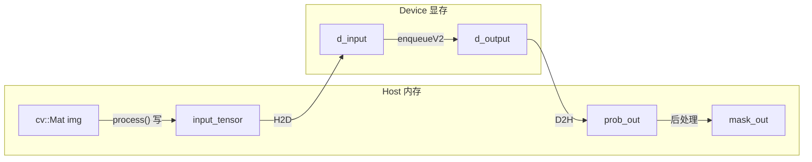
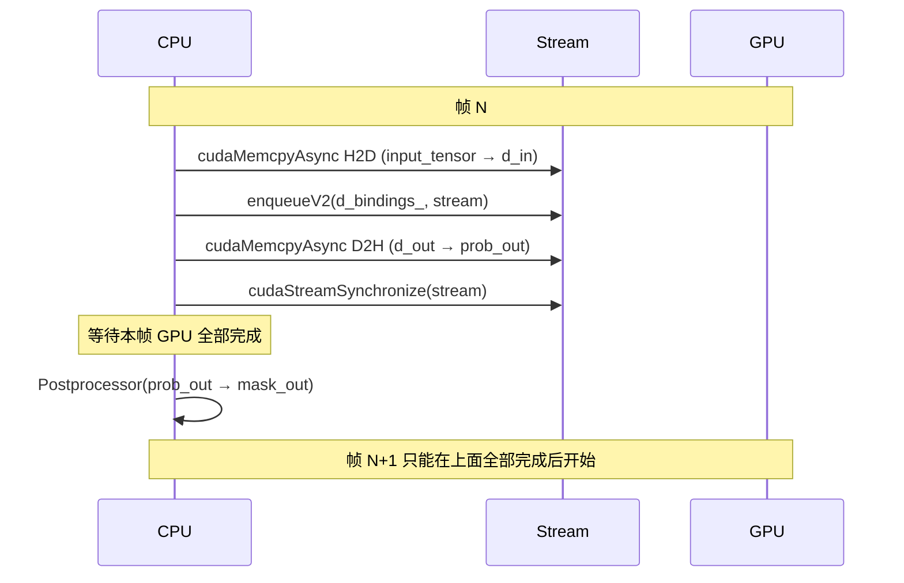

# 息肉分割 TensorRT 推理流程与优化说明

**相关文档**：`部署流水线操作指南.md`（完整流水线与阶段清单）、`性能瓶颈分析说明.md`（benchmark / 压测 / 四维）、`Python与C++前后处理对照.md`（前后处理对齐）、`单元测试说明.md`（Preprocessor / Postprocessor / Metrics 单测）、`导出ONNX之后_C++_TensorRT推理准备.md`（导出与 C++ 准备）。

---

## 1. 项目结构概览

```
polyp_seg_tensorrt/
├── bin/                    # 可执行文件 PolypSegmentationTRT, PolypSegmentationTRT_tests
├── include/                # 头文件
│   ├── common.hpp          # TensorRT 智能指针、Logger
│   ├── InferenceEngine.hpp
│   ├── Metrics.hpp
│   ├── Postprocessor.hpp
│   └── Preprocessor.hpp
├── src/
│   ├── InferenceEngine.cpp # 引擎加载、predict / predictRaw / predictWithTiming
│   ├── main.cpp            # 入口：锚点校验、验证集评估、--benchmark / --stress / --stress-robustness
│   ├── Metrics.cpp         # Dice / IoU
│   ├── Postprocessor.cpp   # 裁边、二值化、resize 回原图
│   └── Preprocessor.cpp    # letterbox、PIL 风格 resize、归一化
├── tests/                  # 单元测试（Preprocessor / Postprocessor / Metrics）
├── scripts/                # 导出 ONNX/engine、生成 anchor、对比 Python/C++
├── models/                 # .pth, .onnx, .engine, anchor/*.bin
├── data/                   # 验证集 images/, masks/
└── docs/                   # 本文档及性能瓶颈、前后处理对照等
```

推理入口：`InferenceEngine::load(engine_path)` 加载引擎，`predict(img, mask_out)` 端到端推理。

---

## 2. 端到端推理流程（Mermaid）


**阶段对应**：Preprocessor.process → predictRaw（H2D + enqueueV2 + D2H）→ Postprocessor.process_with_info。

---

## 3. 数据与拷贝关系（Mermaid）



**当前拷贝要点**：

| 拷贝 | 方向 | 大小 | 说明 |
|------|------|------|------|
| img → input_tensor | CPU 内 | 3×256×256×4 B | Preprocessor 写归一化结果到调用方提供的 buffer |
| input_tensor → d_bindings_[0] | H2D | 768 KB | 每帧一次，cudaMemcpyAsync |
| d_bindings_[1] → prob_out | D2H | 256 KB | 每帧一次，cudaMemcpyAsync |
| prob_out → mask_out | CPU 内 | 后处理裁边+resize | 无额外大块拷贝，mask 尺寸=原图 |

每帧在 Host 上会**新建**两个 `vector<float>`（input_tensor、prob_out），无复用；Device 上 d_bindings_ 复用。

---

## 4. CUDA 流与时间线（Mermaid）

当前为**单流、每帧同步**，无与下一帧的重叠：



**结论**：H2D、Kernel、D2H 在同一 stream 上异步排队，但 CPU 在 `cudaStreamSynchronize` 处阻塞，无法在“等 GPU 时”去准备下一帧的预处理或下一帧的 H2D，因此**没有 CPU–GPU 流水线重叠**。

---

## 5. 是否需要关注：数据拷贝 / I/O / 异步 / 多线程 / CUDA Stream

### 5.1 数据拷贝

- **现状**：每帧 1 次 H2D（768 KB）、1 次 D2H（256 KB），量级小；Host 侧每帧新建 `input_tensor`、`prob_out`，有分配开销。
- **建议**：
  - **双缓冲**：预分配 2 组 input_tensor / prob_out（或 pinned 内存），与流水线配合，避免每帧 malloc/free。
  - **Pinned 内存**：若做 H2D/D2H 与 Kernel 重叠，应用 `cudaMallocHost` 分配输入/输出缓冲，可提高拷贝带宽并利于异步。
  - 当前单帧 ~3.5 ms、拷贝约 1 MB，拷贝占比有限；优先做“重叠”再考虑进一步减拷贝。

### 5.2 I/O

- **现状**：推理引擎内**无磁盘 I/O**；图像由 main/调用方读入（cv::imread 或已预加载的 cv::Mat）。`--stress` 已预加载全部验证集到内存，压测时无读盘。
- **建议**：若生产为“边读边推”（如摄像头/视频文件），可在**调用方**用单独线程或异步接口读下一帧，与推理线程解耦，避免 I/O 阻塞推理；引擎本身保持“输入= cv::Mat”即可。

### 5.3 异步与 CUDA Stream

- **现状**：单 `cudaStream_t`，`cudaMemcpyAsync` + `enqueueV2` + `cudaMemcpyAsync` 后紧跟 `cudaStreamSynchronize`，即“每帧完全同步”。
- **建议**：
  - **双缓冲 + 双 stream（可选）**：Stream A 负责帧 N 的 H2D→Kernel→D2H，Stream B 负责帧 N+1；或同一 stream 上“帧 N 的 D2H”与“帧 N+1 的 H2D”重叠（需两套 host/device 缓冲）。实现复杂度较高，收益取决于 Kernel 与拷贝谁更长；当前 Kernel 占大头，重叠可缩短“端到端墙钟时间”。
  - **保持单 stream**：若吞吐已满足（如 ~289 FPS），可暂不实现重叠，先保证正确性与稳定性。

### 5.4 多线程

- **现状**：单线程：预处理 → 推理 → 后处理 串行。
- **建议**：
  - **流水线**：线程 1 专门做 Preprocessor.process，线程 2 专门做 predictRaw + 后处理，中间用有界队列传递（input_tensor + ImageInfo）与（prob_out + ImageInfo），这样“下一帧预处理”可与“当前帧推理+后处理”并行。需注意 TensorRT context 是否线程安全（一般单 context 多线程调用需加锁或每线程一 context）。
  - **多实例**：多进程或多线程各持有一个 InferenceEngine 实例（每实例独立 context/stream），由调度层分配帧，适合多卡或高吞吐服务；单卡单实例时优先做上述流水线。

### 5.5 小结

| 维度 | 现状 | 是否建议优化 | 说明 |
|------|------|----------------|------|
| 数据拷贝 | 每帧 H2D/D2H 各一次，Host 每帧新建 vector | 可选 | 双缓冲 + pinned 利于后续做重叠 |
| I/O | 引擎内无 I/O；调用方读图 | 视部署而定 | 边读边推时调用方异步/多线程读图 |
| 异步 / Stream | 单 stream，每帧 sync，无重叠 | 可选 | 双缓冲 + 重叠可降延迟，当前吞吐已高 |
| 多线程 | 单线程串行 | 可选 | 预处理与推理+后处理流水线可提吞吐 |

整体上，当前实现已满足“单帧低延迟、高吞吐、稳定”的目标；若需进一步压榨端到端延迟或吞吐，优先考虑 **CPU 预处理与 GPU 推理的流水线（多线程 + 双缓冲）**，再考虑 **H2D/D2H 与 Kernel 的 stream 重叠**。文档中性能瓶颈与压测说明见 `性能瓶颈分析说明.md`。
