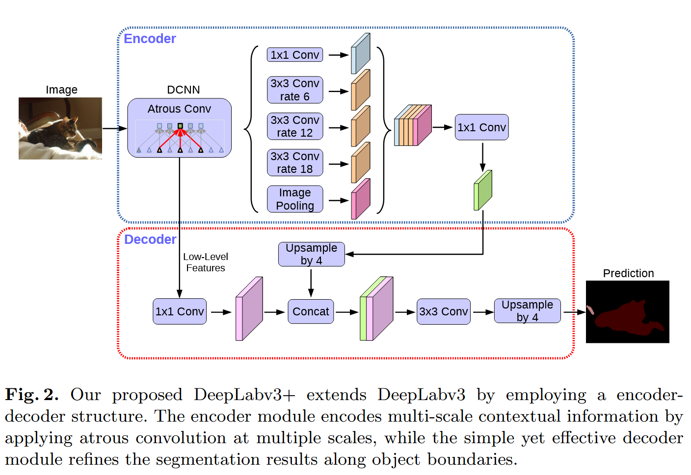

# Encoder-Decoder with Atrous Separable Convolution for Semantic Image Segmentation 逐点精读

**论文**: [Encoder-Decoder with Atrous Separable Convolution for Semantic Image Segmentation](https://arxiv.org/abs/1802.02611)  
**作者**: Liang-Chieh Chen, Yukun Zhu, George Papandreou, Florian Schroff, Hartwig Adam  
**会议**: ECCV 2018  
**年份**: 2018

---

## 目录

- [方法整体介绍（DeepLabv3+ 想解决什么问题？）](#方法整体介绍deeplabv3-想解决什么问题)
- [网络架构](#网络架构)
  - [编码器模块](#编码器模块)
  - [解码器模块](#解码器模块)
  - [深度可分离卷积](#深度可分离卷积)
- [损失函数](#损失函数)
- [训练策略](#训练策略)
- [推理策略](#推理策略)
- [实验对比](#实验对比)
- [结论](#结论)

---

## 方法整体介绍（DeepLabv3+ 想解决什么问题？）

### 前置知识（核心概念）

1. **空洞卷积**：在卷积核元素间插入零值扩大感受野，保持特征图分辨率。扩张率$r$的3×3卷积，有效感受野为$(2r+1)×(2r+1)$。

2. **ASPP模块**：DeepLabv3的核心组件，并行多个不同扩张率的空洞卷积（r=6, 12, 18）捕获多尺度上下文。包含5个分支：1×1卷积、三个3×3空洞卷积、图像级池化，输出拼接后融合。

3. **Output Stride**：输入分辨率/特征图分辨率。DeepLabv3+使用output_stride=16（特征图为输入的1/16），通过将backbone最后两个下采样stride改为1并用空洞卷积补偿实现。

4. **编码器-解码器结构**：编码器提取高级语义特征，解码器恢复空间分辨率。DeepLabv3+的编码器基于DeepLabv3，解码器通过上采样和特征融合恢复边界细节。

**DeepLab系列演进**：

- **V1**：引入空洞卷积 → 解决分辨率问题（保持特征图分辨率同时扩大感受野）
- **V2**：引入ASPP → 解决多尺度问题（捕获不同尺寸目标的上下文）
- **V3**：改进ASPP+全局上下文 → 解决全局语义理解问题（图像级池化+批归一化，实现端到端训练）
- **V3+**：编码器-解码器+深度可分离卷积 → 解决边界精度和效率问题（恢复空间细节+降低计算量）

### DeepLabv3+ 想解决什么问题？

DeepLabv3通过ASPP捕获了丰富的多尺度上下文，但存在两个问题：一是output_stride=16导致特征图分辨率低，物体边界信息丢失，分割结果在边界区域不够精细；二是标准卷积计算量大、参数量多，限制了模型在实际应用中的部署。DeepLabv3+通过两个核心创新解决上述问题：编码器-解码器结构（编码器基于DeepLabv3捕获多尺度上下文，解码器通过上采样和特征融合恢复边界细节）解决边界精度问题，深度可分离卷积（将标准卷积分解为深度卷积和逐点卷积）提升模型效率，在保持DeepLabv3强大语义理解能力的基础上，实现精度与效率的完美平衡。

## 网络架构

DeepLabv3+采用编码器-解码器架构。编码器部分使用ResNet或Xception作为backbone提取特征，在最后两个block使用空洞卷积保持特征图分辨率（output_stride=16），然后通过改进的ASPP模块捕获多尺度上下文信息。解码器部分首先对编码器输出进行4倍上采样，然后与编码器低层特征（backbone的中间层，如ResNet的layer1或layer2）拼接，经过3×3卷积细化后再次上采样到原始分辨率。整个网络可以处理任意大小的输入图像，输出与输入相同分辨率的像素级分割结果。

### 空洞卷积（Atrous Convolution）

**核心思想**：在标准卷积核的元素之间插入零值（空洞），扩大感受野的同时保持特征图的空间分辨率。

**数学表示**：对于1D信号，空洞卷积定义为：
$$y[i] = \sum_{k=1}^{K} x[i + r \cdot k] \cdot w[k]$$

其中$r$为扩张率（atrous rate），$K$为卷积核大小。当$r=1$时，退化为标准卷积；当$r>1$时，在卷积核元素间插入$(r-1)$个零值。

**2D空洞卷积**：对于扩张率为$r$的$k \times k$卷积核，有效感受野为$(2r+1) \times (2r+1)$（当$k=3$时）。例如，$r=6$的3×3空洞卷积，有效感受野为13×13，但参数量仍为9个。

**优势**：

- **保持分辨率**：无需下采样即可扩大感受野，避免信息丢失
- **多尺度特征**：通过不同扩张率捕获不同尺度的上下文信息
- **计算效率**：相比标准卷积+上采样，计算量更小

**在DeepLabv3+中的应用**：

- Backbone最后两个block：将stride从2改为1，用扩张率$r=2, 4$的空洞卷积补偿，实现output_stride=16
- ASPP模块：使用$r=6, 12, 18$的空洞卷积并行捕获多尺度上下文

### 深度可分离卷积（Depthwise Separable Convolution）

**核心思想**：将标准卷积分解为两个步骤：深度卷积（depthwise convolution）和逐点卷积（pointwise convolution），大幅降低计算量和参数量。

**标准卷积**：对于输入特征图$F \in \mathbb{R}^{H \times W \times C_{in}}$，输出$G \in \mathbb{R}^{H \times W \times C_{out}}$，使用$K \times K$卷积核：

- 参数量：$K \times K \times C_{in} \times C_{out}$
- 计算量：$H \times W \times K \times K \times C_{in} \times C_{out}$

**深度可分离卷积**：

1. **深度卷积**：对每个输入通道独立进行$K \times K$卷积
   - 参数量：$K \times K \times C_{in}$
   - 计算量：$H \times W \times K \times K \times C_{in}$
2. **逐点卷积**：使用1×1卷积融合通道信息
   - 参数量：$1 \times 1 \times C_{in} \times C_{out}$
   - 计算量：$H \times W \times C_{in} \times C_{out}$

**效率提升**：
$$\frac{K \times K \times C_{in} + C_{in} \times C_{out}}{K \times K \times C_{in} \times C_{out}} = \frac{1}{C_{out}} + \frac{1}{K^2} \approx \frac{1}{K^2}$$

对于3×3卷积，理论加速比约为8-9倍（当$C_{out}$较大时）。

**在DeepLabv3+中的应用**：

- ASPP模块：所有3×3空洞卷积替换为深度可分离空洞卷积
- 解码器：3×3卷积细化层使用深度可分离卷积
- 改进的Xception：所有标准卷积替换为深度可分离卷积

### 编码器模块

DeepLabv3+的编码器基于**DeepLabv3**，主要包含三个部分：

#### 1. Backbone网络

**ResNet-50/101**：

- 标准ResNet结构，提取多尺度特征
- 最后两个block（layer3和layer4）修改：
  - 将stride从2改为1（避免下采样）
  - 使用空洞卷积（$r=2, 4$）补偿感受野
  - 实现output_stride=16（特征图为输入的1/16）

**改进的Xception**：

- 基于Xception-65/71，针对分割任务优化
- 所有标准卷积替换为深度可分离卷积
- 增加更多层数（entry flow和middle flow）
- 移除ReLU和BN（实验发现对分割任务更有效）
- 在ASPP和解码器中使用深度可分离卷积

#### 2. ASPP模块（Atrous Spatial Pyramid Pooling）

ASPP是DeepLabv3的核心，通过**并行多个不同扩张率的空洞卷积**捕获多尺度上下文：

**5个并行分支**：

1. **1×1卷积**：捕获局部特征，扩张率$r=1$
2. **3×3空洞卷积（$r=6$）**：捕获中等尺度上下文
3. **3×3空洞卷积（$r=12$）**：捕获大尺度上下文
4. **3×3空洞卷积（$r=18$）**：捕获更大尺度上下文
5. **图像级池化**：全局平均池化+1×1卷积+双线性上采样，捕获全局上下文

**输出融合**：

- 所有分支输出通道数相同（通常256）
- 在通道维度拼接（concatenate）
- 通过1×1卷积融合，输出256通道特征图

**DeepLabv3+改进**：

- 所有3×3空洞卷积替换为**深度可分离空洞卷积**
- 降低计算量约33-38%，精度几乎不变

#### 3. 编码器输出

编码器输出特征图：

- 空间分辨率：输入的1/16（output_stride=16）
- 通道数：256（ASPP输出）
- 包含丰富的多尺度语义信息，但空间细节丢失

### 解码器模块

DeepLabv3+新增解码器模块，通过**特征融合和逐步上采样**恢复空间细节：

#### 1. 编码器特征提取

从backbone提取**低层特征**（空间分辨率高，语义信息少）：

- **ResNet**：通常使用layer1或layer2的输出
  - layer1：output_stride=4，通道数256（ResNet-50/101）
  - layer2：output_stride=8，通道数512（ResNet-50/101）
- **Xception**：使用entry flow的中间层特征

#### 2. 解码器结构

**步骤1：编码器输出上采样**

- 对ASPP输出进行**4倍双线性上采样**
- 从output_stride=16恢复到output_stride=4

**步骤2：特征拼接**

- 将上采样后的编码器特征与低层特征拼接（concatenate）
- 通道数：256（编码器）+ 256/512（低层特征）= 512/768

**步骤3：特征细化**

- 使用**3×3深度可分离卷积**细化融合特征
- 输出256通道特征图

**步骤4：最终上采样**

- 再次**4倍双线性上采样**到原始分辨率
- 输出与输入相同尺寸的分割结果

#### 3. 设计要点

**为什么选择4倍上采样？**

- 编码器output_stride=16，需要16倍上采样
- 分两步：4倍（编码器输出）+ 4倍（解码器输出）= 16倍
- 逐步上采样比直接16倍上采样效果更好

**为什么融合低层特征？**

- 低层特征包含丰富的边界和细节信息
- 编码器特征包含高级语义信息
- 融合两者实现**语义理解+边界精度**的平衡

**深度可分离卷积的作用**：

- 解码器中的3×3卷积使用深度可分离卷积
- 降低计算量，提升推理速度
- 对精度影响很小（实验验证）

### 改进的Xception模型

**原始Xception**：

- 基于深度可分离卷积的轻量级网络
- 主要用于图像分类任务

**DeepLabv3+的改进**：

1. **结构扩展**：
   - Entry flow：增加更多层
   - Middle flow：重复8次（Xception-65）或16次（Xception-71）
   - Exit flow：针对分割任务优化

2. **深度可分离卷积应用**：
   - 所有标准卷积替换为深度可分离卷积
   - ASPP模块使用深度可分离空洞卷积
   - 解码器使用深度可分离卷积

3. **激活函数和归一化**：
   - 移除部分ReLU激活（实验发现对分割更有效）
   - 调整BN层的位置和数量

4. **性能提升**：
   - 相比ResNet-101，计算量降低约30-40%
   - 在Pascal VOC 2012上精度提升约1-2%
   - 推理速度提升约20-30%

## 损失函数

## 训练策略

## 推理策略

## 实验对比

## 结论
