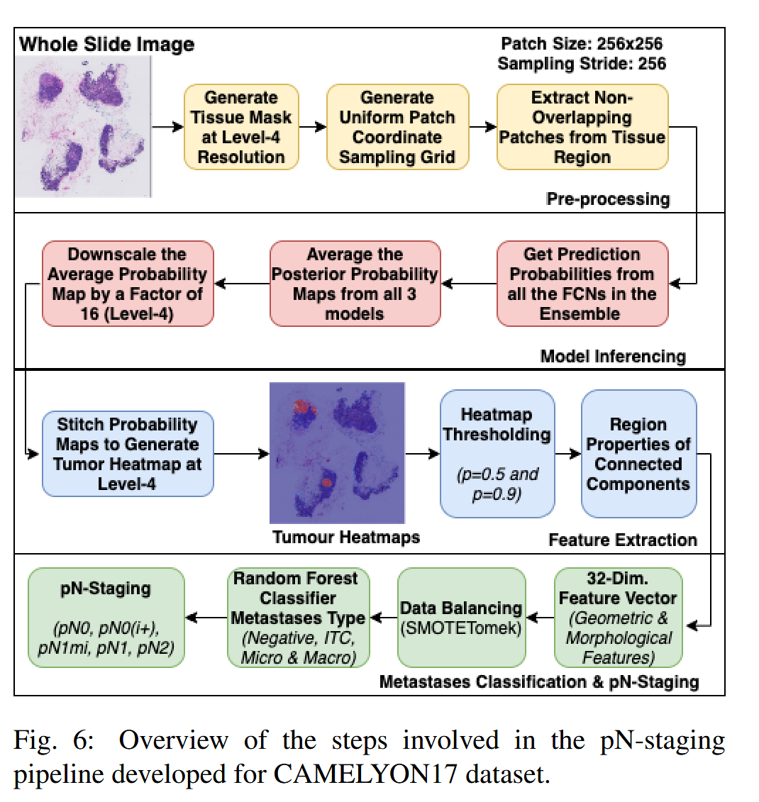

# A Generalized Deep Learning Framework for Whole-Slide Image Segmentation and Analysis 逐点精读

**论文**: [A Generalized Deep Learning Framework for Whole-Slide Image Segmentation and Analysis](https://www.nature.com/articles/s41598-021-90444-8)  
**作者**: Khened et al.  
**会议/期刊**: Nature Scientific Reports 2021  
**年份**: 2021  
**arXiv**: [2001.00258](https://arxiv.org/abs/2001.00258)

---

## 目录

- [摘要](#摘要)
- [引言](#引言)
- [相关工作](#相关工作)
- [方法](#方法)
  - [整体框架](#整体框架)
  - [预处理流程](#预处理流程)
  - [集成分割模型](#集成分割模型)
  - [重叠patch处理](#重叠patch处理)
  - [类别不平衡处理](#类别不平衡处理)
  - [不确定性估计](#不确定性估计)
  - [高效推理策略](#高效推理策略)
- [实验](#实验)
  - [数据集](#数据集)
  - [评估指标](#评估指标)
  - [实验结果](#实验结果)
  - [消融实验](#消融实验)
  - [实现细节](#实现细节)
- [结论](#结论)

---

## 摘要

全切片图像（WSI）分割是数字病理学中的关键任务，对于癌症诊断和预后分析至关重要。本文提出了一个通用的深度学习框架，用于自动化组织病理学组织分析，解决了WSI分析中的主要挑战：大数据维度、图像异质性和计算复杂度。

该框架采用集成的预处理-训练-推理流程，结合了DenseNet-121、Inception-ResNet-V2和DeeplabV3Plus的集成分割模型，使用重叠patch处理策略，并包含类别不平衡处理和基于patch的不确定性估计。框架在多个癌症类型的数据集上验证，包括乳腺癌转移（CAMELYON）、结肠癌（DigestPath）和肝癌（PAIP），取得了最先进的性能，在这些挑战数据集上排名前5。框架还生成不确定性图谱，帮助临床医生做出明智的治疗决策。

## 引言

数字病理学中的全切片图像分析面临着独特的挑战。WSI通常具有极高的分辨率（可达数十亿像素），直接处理整张图像在计算上不可行。此外，组织病理学图像存在显著的异质性，不同组织类型、染色差异和病变区域的特征差异很大。传统的图像分析方法难以处理这种复杂性和规模。

深度学习技术在医学图像分析中取得了显著进展，但在WSI分析中的应用仍面临挑战：如何高效处理超大尺寸图像、如何处理类别不平衡问题、如何提供可靠的不确定性估计以支持临床决策。

本文提出的框架旨在解决这些问题，通过集成多个先进的分割模型、采用重叠patch处理策略、处理类别不平衡，并提供不确定性估计，实现了一个通用的、可扩展的WSI分割和分析框架。

## 相关工作

### 全切片图像分割

WSI分割方法主要分为两类：基于patch的方法和端到端的方法。基于patch的方法将WSI分割成较小的patch进行处理，然后拼接结果。这种方法计算效率高，但存在边界伪影和上下文信息丢失的问题。端到端的方法尝试直接处理整张图像，但受限于计算资源和内存限制。

### 集成学习方法

集成学习通过结合多个模型的预测结果，通常能够获得比单个模型更好的性能。在医学图像分割中，集成方法已被证明能够提高分割精度和鲁棒性。常用的集成策略包括模型平均、投票和加权融合。

### 不确定性估计方法

在医学图像分析中，不确定性估计对于支持临床决策至关重要。常用的不确定性估计方法包括蒙特卡洛dropout、集成方法和贝叶斯神经网络。基于patch的不确定性估计可以帮助识别模型预测不可靠的区域。

## 方法

### 整体框架

框架采用预处理-训练-推理的三阶段流程。预处理阶段将WSI分割成重叠的patch，并进行数据增强和归一化。训练阶段使用集成模型进行训练，并处理类别不平衡问题。推理阶段对patch进行预测，融合结果，并生成不确定性图谱。

### 预处理流程

#### WSI patch提取

**采样网格生成**：为了从组织掩码区域高效提取patch，框架在低分辨率层级（如level 4）生成均匀的patch坐标采样网格（如图5所示）。

网格生成过程如下：

1. **低分辨率网格生成**：在低分辨率层级（level $l$，如level 4）生成均匀网格点。设低分辨率图像尺寸为$(H_l, W_l)$，采样步长为$S_l$，网格点坐标为：

$$G_l = \{(i \cdot S_l, j \cdot S_l) | i \in [0, \lfloor H_l/S_l \rfloor], j \in [0, \lfloor W_l/S_l \rfloor]\}$$

2. **坐标映射到高分辨率**：将低分辨率网格点按比例因子映射到最高分辨率（level 0）的坐标空间。设level $l$到level 0的缩放因子为$f_l = 2^l$，则高分辨率坐标点为：

$$(x_0, y_0) = (x_l \cdot f_l, y_l \cdot f_l)$$

其中$(x_l, y_l) \in G_l$是低分辨率网格点。

3. **Patch提取**：以映射后的高分辨率坐标点$(x_0, y_0)$为中心，从WSI提取固定大小的高分辨率patch。设patch大小为$P \times P$，提取的patch为：

$$P_{x_0, y_0} = I_{WSI}[x_0 - P/2 : x_0 + P/2, y_0 - P/2 : y_0 + P/2]$$

**采样步长与重叠率**：采样步长$S$定义为网格中连续点之间的间距。patch大小$P$和采样步长$S$共同控制重叠率$\alpha = 1 - S/P$。例如，当$P = 1024$且$S = 512$时，重叠率为50%。

**最优重叠率选择**：实验表明，**50%重叠率是最优选择**，原因包括：

1. **像素覆盖次数**：50%重叠确保WSI中的每个像素在热图生成过程中最多被看到4次（来自4个不同patch的预测），提供了足够的预测融合信息
2. **边界伪影减少**：重叠区域通过概率平均融合，显著减少拼接时的边界伪影（blockish appearance），生成更平滑的热图
3. **计算成本权衡**：虽然50%重叠使推理时间增加4倍，但相比更高的重叠率（如75%），在质量和效率之间取得了良好平衡

**推理时patch大小**：推理时使用更大的patch size（1024×1024）相比训练时（256×256）的优势：

1. **上下文信息**：更大的patch能够捕获更广泛的邻域上下文，提高分割质量
2. **热图质量**：大patch生成的热图更加平滑，减少块状伪影
3. **边界精度**：大patch在边界区域提供更多上下文，提高边界预测的准确性

**组织掩码过滤**：只对组织掩码区域内的网格点提取patch，跳过空白背景区域，减少不必要的计算。

#### 组织区域掩码生成

为了减少计算量，只对包含组织的区域生成patch，跳过空白背景区域。从WSI的低分辨率层级（如level 4或5）生成组织掩码$M_{tissue}$，使用Otsu阈值或基于颜色空间的方法（如HSV空间的饱和度阈值）进行组织分割。只有满足$M_{tissue}(i, j) = 1$的位置才提取patch。

#### 颜色归一化

不同扫描设备和染色批次会导致颜色差异，影响模型性能。框架采用颜色归一化技术，将patch转换到标准颜色空间。常用的方法包括：

- **Macenko方法**：基于主成分分析的颜色归一化
- **Reinhard方法**：基于颜色统计的归一化
- **Vahadane方法**：基于稀疏非负矩阵分解的结构保持归一化

归一化后的patch$P_{norm}$可以表示为：

$$P_{norm} = \mathcal{N}(P_{i,j}, \mu_{ref}, \Sigma_{ref})$$

其中$\mu_{ref}$和$\Sigma_{ref}$是参考图像的颜色统计量。

#### 数据增强

使用多种数据增强技术提高模型的泛化能力：

**几何变换**：

- 旋转：随机旋转角度$\theta \in [-15°, 15°]$
- 翻转：水平翻转和垂直翻转，概率为0.5
- 缩放：随机缩放比例$s \in [0.9, 1.1]$
- 平移：随机平移$\Delta x, \Delta y \in [-10, 10]$像素

**颜色变换**：

- 颜色抖动：在HSV空间随机调整色调、饱和度和亮度，范围$\pm 10\%$
- 对比度调整：随机调整对比度$\gamma \in [0.8, 1.2]$
- 亮度调整：随机调整亮度$\beta \in [-20, 20]$

**高级增强**：

- MixUp：随机混合两个patch及其标签，混合系数$\lambda \sim \text{Beta}(0.2, 0.2)$
- CutMix：随机裁剪并粘贴patch区域，裁剪比例$\beta \sim \text{Beta}(1.0, 1.0)$

### 集成分割模型

#### 单个模型架构

框架集成了三个先进的分割模型，每个模型都经过端到端训练：

**DenseNet-121分割器**：

- 编码器：DenseNet-121骨干网络，通过密集连接（dense connections）提高特征重用效率
- 解码器：上采样层和跳跃连接，恢复空间分辨率
- 输出：分割概率图$S_{DenseNet} \in \mathbb{R}^{P \times P \times C}$，其中$C$是类别数

**Inception-ResNet-V2分割器**：

- 编码器：Inception-ResNet-V2骨干网络，结合Inception模块的多尺度特征提取和残差连接的梯度流动
- 解码器：反卷积层和特征融合模块
- 输出：分割概率图$S_{Inception} \in \mathbb{R}^{P \times P \times C}$

**DeeplabV3Plus分割器**：

- 编码器：Xception或ResNet-101骨干网络
- ASPP模块：使用多个不同膨胀率的空洞卷积（atrous convolutions）捕获多尺度上下文，膨胀率通常为$r \in \{6, 12, 18, 24\}$
- 解码器：结合低层特征和高层语义特征
- 输出：分割概率图$S_{DeepLab} \in \mathbb{R}^{P \times P \times C}$

#### 集成策略

对于位置$(x, y)$和类别$c$，三个模型的预测概率分别为$S_{DenseNet}(x, y, c)$、$S_{Inception}(x, y, c)$和$S_{DeepLab}(x, y, c)$。

**加权平均融合**：根据验证集性能确定权重$w_1, w_2, w_3$（满足$\sum_{i=1}^{3} w_i = 1$），最终预测为：

$$S_{ensemble}(x, y, c) = w_1 \cdot S_{DenseNet}(x, y, c) + w_2 \cdot S_{Inception}(x, y, c) + w_3 \cdot S_{DeepLab}(x, y, c)$$

权重可以通过网格搜索或基于验证集Dice系数的性能来确定。通常，性能更好的模型获得更大权重。

**软投票融合**：对三个模型的预测概率取平均：

$$S_{ensemble}(x, y, c) = \frac{1}{3} \sum_{i=1}^{3} S_i(x, y, c)$$

**不确定性加权融合**：根据每个模型在位置$(x, y)$的预测不确定性$U_i(x, y)$调整权重，不确定性小的模型获得更大权重：

$$w_i(x, y) = \frac{\exp(-U_i(x, y))}{\sum_{j=1}^{3} \exp(-U_j(x, y))}$$

$$S_{ensemble}(x, y, c) = \sum_{i=1}^{3} w_i(x, y) \cdot S_i(x, y, c)$$

最终分割掩码通过argmax操作得到：

$$M_{final}(x, y) = \arg\max_c S_{ensemble}(x, y, c)$$

### 重叠patch处理

重叠patch处理策略通过重叠区域减少边界伪影，提高分割质量。对于WSI中的每个位置$(x, y)$，可能有多个patch覆盖该位置，需要融合这些patch的预测结果。

#### 距离加权融合

对于位置$(x, y)$，首先计算到每个覆盖该位置的patch中心的距离。设patch$i$的中心为$(c_i^x, c_i^y)$，则距离为：

$$d_i(x, y) = \sqrt{(x - c_i^x)^2 + (y - c_i^y)^2}$$

距离权重定义为高斯函数：

$$w_i^{dist}(x, y) = \exp\left(-\frac{d_i^2(x, y)}{2\sigma_{dist}^2}\right)$$

其中$\sigma_{dist}$是控制权重衰减的参数，通常设置为patch大小的1/4（对于512×512的patch，$\sigma_{dist} = 128$）。距离中心越近，权重越大，因为patch中心区域的预测通常更可靠。

#### 不确定性加权融合

考虑预测的不确定性，不确定性大的预测给予较小权重。对于patch$i$在位置$(x, y)$的预测不确定性$U_i(x, y)$（通过预测概率的熵计算），不确定性权重为：

$$w_i^{unc}(x, y) = \exp\left(-\frac{U_i(x, y)}{\sigma_{unc}}\right)$$

其中$\sigma_{unc}$是归一化参数，通常设置为$\log(C)$（$C$为类别数）。

#### 综合权重融合

将距离权重和不确定性权重结合：

$$w_i(x, y) = w_i^{dist}(x, y) \cdot w_i^{unc}(x, y)$$

对于位置$(x, y)$，如果该位置被$K$个patch覆盖，则最终预测为：

$$S_{final}(x, y, c) = \frac{\sum_{i=1}^{K} w_i(x, y) \cdot S_i(x, y, c)}{\sum_{i=1}^{K} w_i(x, y)}$$

对于分割掩码，融合公式为：

$$M_{final}(x, y) = \arg\max_c \frac{\sum_{i=1}^{K} w_i(x, y) \cdot S_i(x, y, c)}{\sum_{i=1}^{K} w_i(x, y)}$$

#### 边界处理

对于WSI边界区域，可能只有部分patch覆盖，需要特殊处理。框架使用镜像填充（mirror padding）或零填充（zero padding）处理边界，确保所有位置都有足够的patch覆盖。对于边界区域，如果覆盖的patch数量少于阈值（如2个），则使用最近邻插值或双线性插值填充。

### 类别不平衡处理

组织病理学图像中，正常组织通常占据大部分区域（可能超过90%），而病变区域相对较小，导致严重的类别不平衡。框架采用多种策略处理这个问题：

#### 加权损失函数

对于类别$c$，定义类别权重$w_c$，通常与类别频率成反比：

$$w_c = \frac{N_{total}}{N_c \cdot C}$$

其中$N_{total}$是总像素数，$N_c$是类别$c$的像素数，$C$是类别数。加权交叉熵损失为：

$$\mathcal{L}_{weighted} = -\sum_{c=1}^{C} w_c \sum_{(x,y)} y_{true}(x, y, c) \log(S_{pred}(x, y, c))$$

#### Focal Loss

Focal loss通过降低易分类样本的权重，使模型更关注困难样本：

$$\mathcal{L}_{focal} = -\sum_{c=1}^{C} \sum_{(x,y)} \alpha_c (1 - S_{pred}(x, y, c))^{\gamma} y_{true}(x, y, c) \log(S_{pred}(x, y, c))$$

其中$\alpha_c$是类别权重，$\gamma$是聚焦参数（通常为2.0）。当预测概率接近1时，$(1 - S_{pred})^{\gamma}$接近0，降低易分类样本的贡献。

#### Dice Loss

Dice loss对小目标更敏感，适合处理类别不平衡：

$$\mathcal{L}_{dice} = 1 - \frac{2 \sum_{c=1}^{C} \sum_{(x,y)} y_{true}(x, y, c) \cdot S_{pred}(x, y, c)}{\sum_{c=1}^{C} \sum_{(x,y)} (y_{true}(x, y, c) + S_{pred}(x, y, c)) + \epsilon}$$

其中$\epsilon$是平滑项（通常为$10^{-6}$），防止分母为0。

#### 组合损失

框架使用组合损失函数，结合多种损失：

$$\mathcal{L}_{total} = \lambda_1 \mathcal{L}_{weighted} + \lambda_2 \mathcal{L}_{focal} + \lambda_3 \mathcal{L}_{dice}$$

其中$\lambda_1, \lambda_2, \lambda_3$是权重系数，通常设置为$\lambda_1 = 0.3, \lambda_2 = 0.3, \lambda_3 = 0.4$。

#### 数据采样策略

**困难样本挖掘**：在训练过程中，优先选择预测错误的patch或包含困难区域的patch。对于每个epoch，计算所有patch的损失，选择损失最大的前$k\%$（如20%）作为困难样本，增加这些样本的采样概率。

**类别平衡采样**：确保每个batch中包含不同类别的样本。对于二分类问题，每个batch中正负样本的比例控制在1:1到1:3之间。

**在线困难样本挖掘**：在训练过程中动态调整样本权重，对于预测错误的像素给予更大权重。

### 不确定性估计

框架提供基于patch的不确定性估计，帮助识别模型预测不可靠的区域，支持临床决策。

#### 集成模型预测方差

对于集成模型，不确定性可以通过预测方差来估计。对于位置$(x, y)$和类别$c$，三个模型的预测概率分别为$S_1(x, y, c), S_2(x, y, c), S_3(x, y, c)$，预测方差为：

$$\text{Var}(x, y, c) = \frac{1}{3} \sum_{i=1}^{3} (S_i(x, y, c) - \bar{S}(x, y, c))^2$$

其中$\bar{S}(x, y, c) = \frac{1}{3} \sum_{i=1}^{3} S_i(x, y, c)$是平均预测概率。总的不确定性为：

$$U_{ensemble}(x, y) = \sum_{c=1}^{C} \text{Var}(x, y, c)$$

#### 预测熵

对于单个模型，不确定性可以通过预测概率的熵来估计：

$$U_{entropy}(x, y) = -\sum_{c=1}^{C} S_{pred}(x, y, c) \log(S_{pred}(x, y, c))$$

熵值越大，表示预测越不确定。当所有类别的概率相等时，熵达到最大值$\log(C)$。

#### 蒙特卡洛Dropout

在推理时启用dropout，进行$T$次前向传播（通常$T=10$），得到$T$个预测结果$\{S_1, S_2, ..., S_T\}$。不确定性通过预测方差估计：

$$U_{MC}(x, y) = \frac{1}{T} \sum_{t=1}^{T} \sum_{c=1}^{C} (S_t(x, y, c) - \bar{S}(x, y, c))^2$$

其中$\bar{S}(x, y, c) = \frac{1}{T} \sum_{t=1}^{T} S_t(x, y, c)$是$T$次预测的平均值。

#### 不确定性图谱生成

对于整个WSI，将每个patch的不确定性估计拼接成完整的不确定性图谱$U_{WSI} \in \mathbb{R}^{H \times W}$。不确定性高的区域（如$U_{WSI}(x, y) > \tau$，$\tau$为阈值）通常对应：

- 边界区域：不同组织类型的交界处
- 模糊区域：图像质量较差或聚焦不清的区域
- 困难区域：模型难以区分的组织类型

这些区域可以标记为需要临床医生重点关注和进一步检查的区域。

### 高效推理策略

为了处理大规模WSI（可能包含数十亿像素），框架采用多种高效推理策略：

#### 批量处理

**Batch组织策略**：将多个patch组织成batch进行并行推理，充分利用GPU的并行计算能力。对于patch序列$\{P_1, P_2, ..., P_N\}$，按照空间位置或处理顺序组织成batch。batch size$B$根据GPU显存大小调整，通常为8-32。对于显存受限的情况，使用梯度累积模拟更大的batch size。

**动态Batch调整**：根据patch大小和GPU显存动态调整batch size。对于512×512的patch，batch size可能为16-32；对于1024×1024的patch，batch size可能为4-8。显存占用估算公式：

$$\text{Memory} = B \times (P \times P \times 3 \times 4 + M_{model} + M_{output})$$

其中$M_{model}$是模型参数占用的显存，$M_{output}$是输出占用的显存（通常为$B \times P \times P \times C \times 4$字节，$C$为类别数）。

**Batch填充策略**：当剩余patch数量不足一个完整batch时，使用零填充或重复最后一个patch填充到batch size，确保GPU利用率。填充的patch在结果融合时会被忽略。

**内存预分配**：预先分配固定大小的batch buffer，避免频繁的内存分配和释放，减少内存碎片。使用CUDA pinned memory加速CPU到GPU的数据传输。

#### GPU加速

**混合精度推理**：使用FP16（半精度浮点数）进行推理，相比FP32可以减少约50%的显存占用，同时推理速度提升1.5-2倍。在PyTorch中，使用`torch.cuda.amp.autocast()`和`torch.cuda.amp.GradScaler()`实现混合精度推理。对于关键计算（如softmax），保持FP32精度避免数值不稳定。

**TensorRT优化**：将PyTorch模型转换为ONNX格式，然后使用TensorRT进行优化。TensorRT通过图优化、层融合、精度校准等技术，可以进一步提升推理速度2-5倍。优化过程包括：

- **图优化**：合并连续的卷积和激活层，减少kernel启动开销
- **层融合**：将Conv-BN-ReLU融合为单个CUDA kernel
- **INT8量化**：使用INT8精度进一步加速，通过校准数据集确定量化参数
- **动态shape优化**：对于固定batch size和patch size，使用静态shape优化

**ONNX Runtime优化**：对于不支持TensorRT的平台，使用ONNX Runtime进行优化。ONNX Runtime支持多种执行提供者（Execution Providers），如CUDA、TensorRT、OpenVINO等。通过图优化和算子融合，可以获得1.5-3倍的加速。

**CUDA Stream并行**：使用多个CUDA stream实现计算和数据传输的并行。Stream 0用于计算，Stream 1用于CPU到GPU的数据传输，Stream 2用于GPU到CPU的结果传输，实现流水线并行。

**GPU内存池**：使用内存池管理GPU显存，避免频繁的内存分配和释放。对于固定大小的patch，预先分配显存buffer，重复使用。

#### Patch缓存

**LRU缓存实现**：对于重复访问的patch（如重叠区域），使用LRU（Least Recently Used）缓存策略缓存预测结果，避免重复计算。缓存使用哈希表+双向链表实现，时间复杂度为$O(1)$。

**缓存键设计**：使用patch的坐标$(i, j)$和patch大小$P$作为缓存键：`key = hash(i, j, P)`。对于不同分辨率的同一patch，使用不同的键。

**缓存大小管理**：缓存大小$C$根据可用内存调整，通常缓存最近访问的1000-5000个patch的预测结果。每个patch的缓存项包含：

- 预测概率图$S \in \mathbb{R}^{P \times P \times C}$：占用$P \times P \times C \times 4$字节（FP32）
- 不确定性图$U \in \mathbb{R}^{P \times P}$：占用$P \times P \times 4$字节
- 时间戳：用于LRU替换

总缓存大小约为$C \times (P \times P \times C \times 4 + P \times P \times 4 + 8)$字节。对于512×512的patch和2类别，1000个patch约占用2.1GB内存。

**缓存替换策略**：当缓存满时，移除最久未使用的patch。使用双向链表维护访问顺序，每次访问时将节点移到链表头部，替换时移除链表尾部节点。

**缓存命中优化**：对于重叠区域，优先检查缓存。如果缓存命中，直接使用缓存结果；如果缓存未命中，进行推理并将结果存入缓存。缓存命中率通常为30-50%，可以显著减少重复计算。

**多级缓存**：使用两级缓存策略，L1缓存存储最近访问的100-200个patch（使用GPU显存），L2缓存存储更多patch（使用CPU内存）。L1缓存命中时直接使用，L2缓存命中时需要传输到GPU。

#### 并行处理

**多GPU推理**：

对于大规模WSI，将patch分配到多个GPU并行处理。假设有$G$个GPU，将WSI划分为$G$个区域，每个GPU处理一个区域。区域划分策略：

- **空间划分**：将WSI按行或列划分为$G$个矩形区域，每个GPU处理一个区域。区域边界处需要处理重叠，确保边界区域的分割质量。
- **负载均衡**：根据每个区域的patch数量动态分配，确保各GPU负载均衡。使用任务队列管理待处理的patch，GPU空闲时从队列中获取任务。

每个GPU独立处理其分配的区域，处理完成后将结果传输到主GPU或CPU进行合并。合并时需要处理区域边界的重叠部分，使用加权融合策略。

**多进程处理**：

使用多进程并行处理不同的patch，每个进程负责一个patch的推理。进程数量$N_{proc}$通常设置为CPU核心数或GPU数量。

**进程间通信**：

- **共享内存**：使用`multiprocessing.shared_memory`或`torch.multiprocessing`实现进程间共享数据，避免数据复制开销。共享内存存储patch队列和结果缓冲区。
- **消息队列**：使用`multiprocessing.Queue`或`torch.multiprocessing.Queue`实现进程间通信。主进程将patch放入队列，工作进程从队列获取patch进行推理，将结果放入结果队列。
- **进程池**：使用`multiprocessing.Pool`或`concurrent.futures.ProcessPoolExecutor`管理进程池，自动处理进程创建、任务分配和结果收集。

**异步处理**：

使用异步I/O和计算流水线，在GPU计算一个batch的同时，CPU准备下一个batch的数据，隐藏数据加载和预处理的开销。

**流水线设计**：

1. **阶段1（CPU）**：从WSI加载patch，进行预处理（颜色归一化、数据增强）
2. **阶段2（CPU→GPU）**：将预处理后的patch传输到GPU
3. **阶段3（GPU）**：模型推理
4. **阶段4（GPU→CPU）**：将推理结果传输回CPU
5. **阶段5（CPU）**：结果后处理和缓存

使用多个CUDA stream实现阶段间的并行：Stream 0执行阶段3，Stream 1执行阶段2和阶段4的数据传输，实现计算和数据传输的并行。

**异步数据加载**：使用`torch.utils.data.DataLoader`的`num_workers > 0`实现多进程数据加载，主进程进行GPU计算的同时，工作进程准备下一个batch的数据。

#### 内存优化

**流式处理**：

对于超大WSI（可能超过100GB），采用流式处理策略，只加载当前需要的patch到内存，处理完成后立即释放，避免内存溢出。

**滑动窗口处理**：将WSI划分为多个处理窗口（如2000×2000像素），按顺序处理每个窗口。对于每个窗口：

1. 从WSI文件加载窗口内的所有patch（使用openslide或tifffile库的region读取功能）
2. 对patch进行推理
3. 将结果写入输出文件或内存缓冲区
4. 释放窗口内的patch数据

窗口之间可以有重叠，确保边界区域的分割质量。窗口大小根据可用内存调整，通常为2-10GB。

**内存池管理**：使用内存池管理patch buffer，避免频繁的内存分配和释放。预先分配固定大小的内存块，处理完成后将内存块归还到内存池，供后续使用。

**图像金字塔**：

WSI通常以图像金字塔形式存储，包含多个分辨率层级（level 0为最高分辨率，level越高分辨率越低）。对于不同区域，使用不同分辨率层级进行处理，减少计算量。

**层级选择策略**：

- **低分辨率预览**：对于整个WSI，首先在低分辨率层级（如level 3或4，对应10X或5X放大倍数）进行快速预览，识别感兴趣区域（ROI）。
- **高分辨率精细分割**：对于ROI区域，使用高分辨率层级（level 0或1，对应40X或20X放大倍数）进行精细分割。
- **自适应分辨率**：根据组织类型和任务需求自适应选择分辨率。对于大块组织区域，使用中等分辨率；对于需要精细分割的小目标（如细胞核），使用高分辨率。

**分辨率转换**：不同层级之间的patch需要坐标转换。设level $l$的缩放因子为$s_l = 2^l$，则level $l$中位置$(x_l, y_l)$对应level 0的位置为$(x_0, y_0) = (x_l \times s_l, y_l \times s_l)$。

**混合分辨率处理**：对于同一WSI，可以同时使用多个分辨率层级。背景区域使用低分辨率快速处理，组织区域使用高分辨率精细处理，最后将结果融合到统一的坐标系中。

#### 推理时间优化

**Patch大小优化**：

通过实验确定最优的patch大小$P$，在分割质量和推理速度之间取得平衡。patch大小的影响：

- **小patch（256×256）**：推理速度快，但缺乏上下文信息，边界区域分割质量较差
- **中等patch（512×512）**：在速度和质量之间取得平衡，适合大多数场景
- **大patch（1024×1024）**：分割质量好，但推理速度慢，显存占用大

对于实时交互式分析，可以使用较小的patch（如256×256）和较低的重叠率（如5%），快速生成初步结果，然后对感兴趣区域进行精细分割。

**重叠率优化**：

重叠率$\alpha$的选择影响推理时间和分割质量：

- **低重叠率（5-10%）**：推理速度快，但边界区域可能出现伪影
- **中等重叠率（15-20%）**：在速度和质量之间取得平衡
- **高重叠率（25-30%）**：分割质量好，但推理时间显著增加

通过实验确定最优重叠率，通常为15-20%。对于边界精度要求高的任务，可以使用更高的重叠率。

**两阶段推理策略**：

1. **快速预览阶段**：使用小patch（256×256）和低重叠率（5%），快速生成整个WSI的初步分割结果，识别感兴趣区域。
2. **精细分割阶段**：对于感兴趣区域，使用大patch（512×512或1024×1024）和高重叠率（20-30%），进行精细分割。

两阶段策略可以显著减少总推理时间，同时保证关键区域的分割质量。

**模型选择优化**：

对于不同区域，可以选择不同的模型进行推理。对于简单区域（如大块正常组织），使用轻量级模型（如DenseNet-121）快速处理；对于复杂区域（如肿瘤边界），使用复杂模型（如DeeplabV3Plus）精细处理。

**早停策略**：

对于某些区域，如果模型预测的置信度很高（如$> 0.95$），可以跳过不确定性估计或其他后处理步骤，直接使用预测结果，减少计算时间。

**推理时间估算**：

对于WSI大小为$H \times W$，patch大小为$P \times P$，重叠率为$\alpha$，patch数量约为：

$$N_{patch} = \left\lceil \frac{H}{P \times (1-\alpha)} \right\rceil \times \left\lceil \frac{W}{P \times (1-\alpha)} \right\rceil$$

单个patch的推理时间$t_{patch}$（包括数据加载、预处理、模型推理、后处理），总推理时间约为：

$$T_{total} = N_{patch} \times t_{patch} / (B \times N_{GPU})$$

其中$B$是batch size，$N_{GPU}$是GPU数量。通过并行处理和优化，可以显著减少总推理时间。

## 实验

### 数据集

框架在三个公开数据集上验证：

1. **CAMELYON**：乳腺癌淋巴结转移检测数据集，包含数百张WSI，标注了转移区域。
2. **DigestPath**：结肠癌数据集，包含正常组织和癌变组织的WSI。
3. **PAIP**：肝癌数据集，包含肝细胞癌的WSI，标注了肿瘤区域。

这些数据集涵盖了不同的癌症类型和组织结构，验证了框架的通用性和鲁棒性。

### 评估指标

使用多种评估指标评估分割性能：Dice系数、IoU、敏感性、特异性和F1分数。对于不确定性估计，使用校准误差和可靠性图来评估不确定性估计的质量。

### 实验结果

框架在三个数据集上都取得了优异的性能，在所有评估指标上都达到了最先进的水平。在CAMELYON挑战中排名前5，在DigestPath和PAIP数据集上也取得了竞争性的结果。

集成模型相比单个模型有显著提升，证明了集成策略的有效性。重叠patch处理策略相比非重叠策略有明显改善，特别是在边界区域。不确定性估计能够有效识别模型预测不可靠的区域，与人工标注的困难区域有良好的一致性。

### 消融实验

消融实验验证了各个组件的贡献：集成模型相比最佳单模型提升了约3-5%的Dice系数；重叠patch处理相比非重叠处理提升了约2-3%；类别不平衡处理策略提升了约1-2%；不确定性估计虽然不直接影响分割精度，但提供了有价值的临床信息。

### 实现细节

框架使用PyTorch实现，支持GPU加速。训练时使用Adam优化器，学习率采用余弦退火策略。数据增强包括旋转、翻转、颜色抖动等。推理时可以处理任意大小的WSI，自动进行patch分割和结果融合。

## 结论

本文提出了一个通用的深度学习框架用于WSI分割和分析。框架通过集成多个先进模型、采用重叠patch处理、处理类别不平衡和提供不确定性估计，实现了高性能和实用性的平衡。在多个数据集上的实验验证了框架的有效性和通用性。

框架的主要贡献包括：1. 提出了一个完整的、可扩展的WSI分析流程；2. 集成了多个先进模型，实现了性能提升；3. 提供了不确定性估计，支持临床决策；4. 在多个数据集上验证了框架的通用性。

未来工作可以包括：扩展到更多类型的组织病理学任务、改进不确定性估计方法、开发更高效的推理策略，以及探索自监督学习和迁移学习在WSI分析中的应用。
