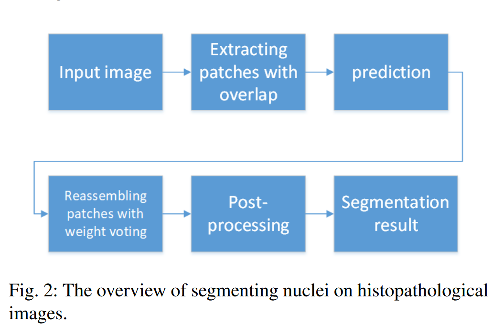
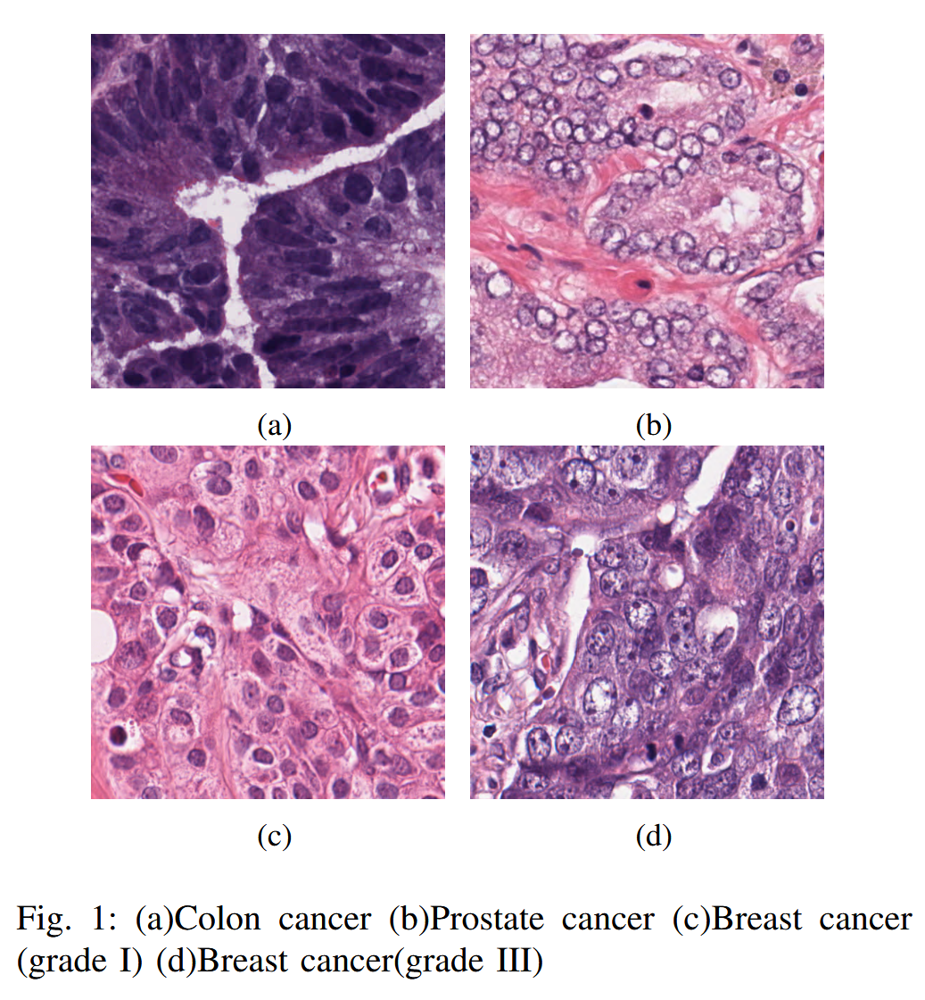
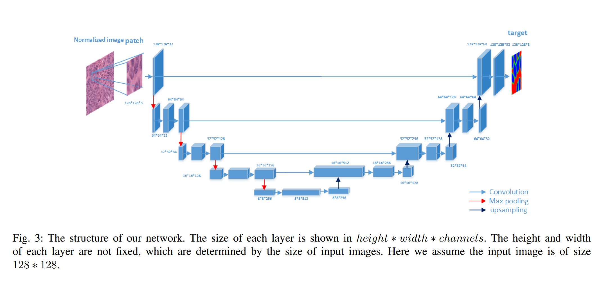
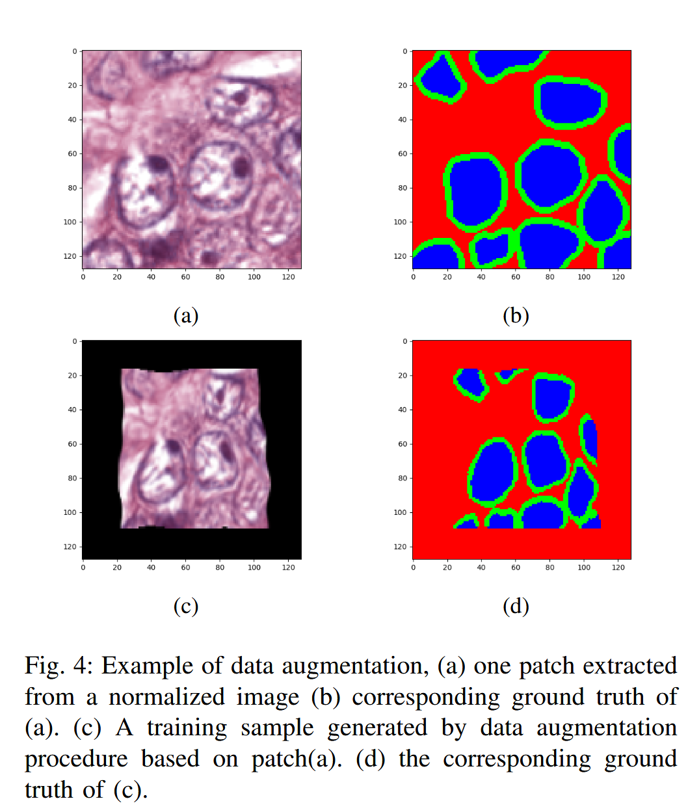
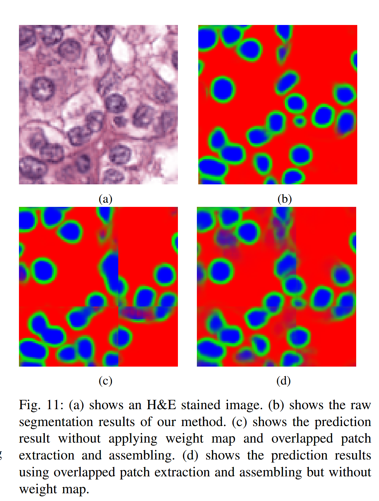

# A Deep Learning Algorithm for One-step Contour Aware Nuclei Segmentation 逐点精读

**论文**: [A Deep Learning Algorithm for One-step Contour Aware Nuclei Segmentation](https://arxiv.org/abs/1803.02786)  
**作者**: Yuxin Cui, Guiying Zhang, Zhonghao Liu, Zheng Xiong, Jianjun Hu  
**期刊**: Medical & Biological Engineering & Computing  
**年份**: 2018 (arXiv), 2019 (正式发表)  
**代码**: [GitHub Repository](https://github.com/easycui/nuclei_segmentation)

---

## 目录

- [背景](#背景)
- [方法](#方法)
  - [A. 方法整体介绍（Overview）](#a-方法整体介绍overview)
  - [B. 数据预处理（Data Preprocessing）](#b-数据预处理data-preprocessing)
  - [C. 核-边界模型（Nucleus-boundary Model）](#c-核-边界模型nucleus-boundary-model)
    - [1) 网络架构（The Architecture of Our NB Network）](#1-网络架构the-architecture-of-our-nb-network)
    - [2) 数据增强（Data Augmentation）](#2-数据增强data-augmentation)
    - [3) 加权损失（Weighted Loss）](#3-加权损失weighted-loss)
    - [4) 超大图像分割（Extra-large Image Segmentation Using Overlapped Patch Extraction and Assembling）](#4-超大图像分割extra-large-image-segmentation-using-overlapped-patch-extraction-and-assembling)
    - [5) 后处理（Post-processing）](#5-后处理post-processing)
- [实验](#实验)
  - [数据集](#数据集)
  - [评估指标](#评估指标)
  - [实验结果](#实验结果)
  - [消融实验](#消融实验)
- [结论](#结论)

---

## 背景

随着图像处理和模式识别技术的进步，计算机辅助诊断（CAD）已被广泛用于协助医疗专业人员解释医学图像。数字病理学作为CAD应用的重要方面，由于全切片成像的出现，正受到越来越多关注。组织病理图像分析在癌症诊断中发挥重要作用，核分割是其中的关键步骤。核分割不仅要计数细胞核数量，还要获得每个细胞核的详细信息（轮廓），用于进一步分析，如乳腺癌分级和分类。由于颜色、形状和纹理等外观变化，核分割极具挑战性。

传统核分割方法通常分为两步：先检测细胞核，再获得轮廓。检测方法包括强度阈值化、聚类、基于过滤的方法等，但只对特定类型有效且对参数敏感。监督学习方法将像素分为核/背景两类，但需要复杂后处理来分离接触的细胞核。基于深度学习的方法在图像分割中表现优异，FCN和U-net等全卷积网络在医学图像分割中取得显著进展。但现有深度学习方法通常需要复杂后处理来获得最终边界，且处理全切片图像时存在边界区域预测不准确的问题。

本文提出核-边界模型，使用全卷积网络同时预测细胞核及其边界，避免了复杂后处理。主要贡献包括：核-边界模型显式检测核和边界；开发超大图像分割方法，使用加权损失图和投票机制；提供数据增强方法的效果研究；引入四个新评估标准（MDR、FDR、USR、OSR）用于更准确的性能评估。

## 方法

### A. 方法整体介绍（Overview）

我们的核分割方法采用端到端深度学习框架。唯一的预处理程序是图像颜色归一化。在训练阶段，不提取任何特征（甚至不提取H通道），直接将归一化RGB颜色的组织病理图像应用到深度神经网络来训练核-边界模型。在测试阶段，原始归一化图像通过核-边界检测器产生的预测结果显示了清晰的内部细胞核区域和边界。最后，通过简单、快速且无参数的后处理程序获得每个细胞核的区域。图2显示了从颜色归一化图像中分割细胞核的流程。



### B. 数据预处理（Data Preprocessing）

H&E染色是医学诊断中应用最广泛的染色方案。通常情况下，细胞核被苏木素染成蓝色，细胞质被伊红染成粉红色。但在实际应用中，由于H&E试剂、染色过程、扫描仪和染色专家的不同，H&E染色图像的颜色会有很大的变化，如图1所示。



一些H&E染色标准化方法已经被提出，以消除由颜色变化引起的负干扰。本文使用基于稀疏非负矩阵分解（NMF）的颜色归一化方法（Vahadane方法），将图像的颜色转换到目标图像的颜色空间。我们选择一幅染色最好的H&E图像作为目标，并将其他图像转换到其颜色空间。超参数 $\lambda$ 设置为0.1。

颜色去卷积（color deconvolution）基于比尔-朗伯定律（Beer-Lambert Law），将RGB图像转换到光密度（OD）空间，然后通过矩阵分解将混合的染色分离为独立的染料成分。去卷积过程可以表示为 $OD = W \cdot H$，其中 $W$ 是染料颜色基矩阵（3×2，对应Hematoxylin和Eosin），$H$ 是染料浓度矩阵（2×N，N为像素数）。传统方法（如Ruifrok-Johnston方法）使用固定的颜色向量进行去卷积，而Vahadane方法通过稀疏非负矩阵分解（SNMF）自适应地学习颜色基矩阵，能够更好地适应不同图像的染色风格。

传统分割方法通常从去卷积结果中提取H通道（Hematoxylin的浓度分布），得到单通道灰度图像进行分割，因为理论上H通道比RGB图像更容易区分前景（细胞核）和背景（细胞质）。然而，基于我们的实验，深度全卷积神经网络从原始RGB图像中提取细胞核的效果优于从H通道灰度图像中提取细胞核的效果。原因可能是H通道遗漏了一些有助于区分细胞核和细胞质的信息。给定标注良好的训练图像，深度神经网络可以学习到最优的方式来提取区分每一类样本的特征。因此，我们虽然使用Vahadane方法进行颜色归一化，但跳过提取H通道的步骤，直接将归一化后的RGB彩色图像作为深度神经网络的输入。

### C. 核-边界模型（Nucleus-boundary Model）

传统监督核分割方法使用滑动窗口策略，对每个patch预测中心像素类别，计算复杂度高（1000×1000图像需处理百万个patch）。本文方法基于全卷积网络（FCN）框架，通过一次前向传播预测所有像素的类别。

核分割任务分为两个阶段：提取前景（细胞核）和分离边界。本文方法通过同时提取细胞核及其边界来合并这两个步骤，因此称为"核-边界（NB）模型"。如图所示，NB模型输出三个通道，分别表示每个像素属于背景、边界或内部类的概率。

手动标注是每个细胞核的边界。边界类像素定义为在标注边界上或边界内、距离边界2像素以内的像素；内部类像素是边界内但非边界的像素。输出可视为RGB图像，背景、边界和细胞核分别用红、绿、蓝表示。为生成三分类掩码，对每个细胞核应用形态学操作获得内部像素，然后从细胞核中减去内部像素得到边界像素。

#### 1) 网络架构（The Architecture of Our NB Network）

图3显示了算法的网络架构，由编码层和解码层组成。编码层用于提取不同层次的上下文特征图。解码层设计用于融合编码层产生的特征图，生成所需的分割图。由于GPU内存限制，输入层尺寸设置为128×128。但我们注意到更大的输入尺寸可能带来更好的性能。



每个卷积层的权重使用`Glorot uniform初始化`，偏置初始化为0。Glorot uniform定义为：

$$W \sim \text{Uniform}\left(-\frac{\sqrt{6}}{\sqrt{n_j + n_{j+1}}}, \frac{\sqrt{6}}{\sqrt{n_j + n_{j+1}}}\right)$$

其中 $W$ 表示初始化的权重，$n_j$ 表示卷积层 $j$ 的大小。

缩放指数线性单元（SELU）激活函数用于所有卷积层。SELU设计用于使前馈神经网络（FNN）具有自归一化能力。使用SELU的FNN能够输出优于使用显式归一化方法（如批量归一化、层归一化、权重归一化）的网络。这就是为什么我们的网络不包含任何归一化层。SELU激活函数定义为：

$$\text{selu}(x) = \begin{cases} \lambda x & \text{if } x \geq 0 \\ \alpha(e^x - 1) & \text{if } x \leq 0 \end{cases}$$

其中 $\lambda = 1.0507$，$\alpha = 1.6733$。

每个卷积层的填充属性设置为'same'，以确保与前一层保持相同的尺寸。所有卷积滤波器尺寸为3×3。每个卷积层后跟一个dropout层，dropout率为0.2。网络使用Adam优化器进行训练。这种随机优化方法能够为每个参数计算自适应学习率，自动控制训练过程中的学习率，因此不需要手动设置动量和衰减。

**代码实现**（参考[GitHub仓库](https://github.com/easycui/nuclei_segmentation)）：

**三通道输出关键代码**：

```python
# U-Net骨干网络提取特征
features = unet_backbone(inputs, act='selu')  # [batch, 32, 128, 128]

# 1×1卷积映射到3个类别
output = Conv2D(3, (1, 1), activation='selu', data_format='channels_first')(features)  # [batch, 3, 128, 128]

# Reshape并应用softmax
output = Reshape((3, 128*128))(output)
output = Permute((2, 1))(output)  # [batch, 128*128, 3]
output = Activation('softmax')(output)  # 确保三个类别概率和为1
```

**关键点**：
- **U-Net架构**：编码器-解码器结构，带跳跃连接（4层下采样+4层上采样）
- **三通道输出**：1×1卷积将32通道特征图映射到3通道（背景、边界、内部）
- **Softmax**：reshape为`[batch, height*width, 3]`后应用softmax，确保每个像素的三个类别概率和为1
- **加权损失**：通过`loss_weights`和`sample_weight_mode`实现位置加权

#### 2) 数据增强（Data Augmentation）

深度学习模型通常有数百万个参数，需要大规模样本数据集来避免过拟合问题。实际上，核分割任务的数据集通常只包含几十张图像。此外，标注一张包含数百个细胞核的1000×1000图像通常需要专家至少5小时。因此，不可能手动标注足够数量的核边界来训练深度学习模型。

数据增强是克服样本不足导致的过拟合问题的重要方法。训练样本（即patch）从训练数据集的H&E染色图像中`随机提取`。五种增强技术在我们的实验中一起使用：`随机弹性变形、缩放、仿射变换、平移、翻转和旋转`。每个训练样本（从整张图像中提取的一个patch）以及对应的目标都经过数据增强处理。

给定一个训练样本，即RGB图像 $I$ 及其对应的真实标签 $I_{gt}$，将 $I$ 变换为 $I'$，$I_{gt}$ 变换为 $I'_{gt}$。$I'$ 和 $I'_{gt}$ 是神经网络的真实输入和目标。

缩放因子设置为0.5-1.5之间的随机数。我们使用`Simard`的方法进行弹性变形。需要手动设置两个超参数 $\alpha$ 和 $\sigma$ 来控制原始图像变形的剧烈程度。在实验中，$\alpha$ 设置为100-200之间的随机数，$\sigma$ 设置为12。

除了变换输入样本，还需要对目标进行相同的变换以保持一致性。one-hot编码目标只包含二进制值。然而，由于弹性变形中使用的双线性插值，变换后的目标有一些浮点数。需要按照以下规则进行二值化：

设一个像素的值为 $(t_i, t_b, t_o)$，其中 $t_i$、$t_b$ 和 $t_o$ 分别表示内部、边界和背景的标签：

1. 如果 $t_b > 0.5$，则 $t_b = 1$，否则 $t_b = 0$
2. 如果 $t_i > 0$ 且 $t_b == 0$，则 $t_i = 1$，否则 $t_i = 0$
3. 如果 $t_i == 1$ 或 $t_b == 1$，则 $t_o = 0$，否则 $t_o = 1$


数据增强的示例如图4所示。



#### 3) 加权损失（Weighted Loss）

**问题背景**：U-Net模型在预测时，边界区域由于缺乏足够的上下文信息，预测精度较低。传统U-Net通过不预测边界区域来解决这个问题，但这存在两个局限性：（1）边界区域大小固定，无法根据图像内容自适应调整；（2）训练时需要裁剪操作以匹配层尺寸，可能丢失有用信息。

**解决方案**：本文允许网络预测整个图像（包括边界），但通过加权损失函数降低边界区域预测错误对总损失的影响。这样既避免了固定边界大小的问题，又保持了输入输出尺寸一致。

**损失函数**：模型通过最小化加权分类softmax交叉熵损失来训练：

$$L = -\sum_i \sum_j W_{i,j} \log(p_{t(i,j)}(i,j))$$

其中 $t(i,j)$ 表示位置 $(i,j)$ 的真实标签，$p_{t(i,j)}(i,j)$ 是softmax激活层的输出，表示该像素属于类别 $t(i,j)$ 的概率。

**权重图设计**：权重图 $W$ 的设计原则是：边界区域权重小，中心区域权重大。权重定义为：

$$W_{i,j} = \alpha \cdot \frac{D^e_{i,j}}{D^c_{i,j} + D^e_{i,j}}$$

其中：
- $D^e_{i,j}$ 是像素 $(i,j)$ 到图像边界的距离（到最近边界的欧氏距离）
- $D^c_{i,j}$ 是像素 $(i,j)$ 到图像中心的距离
- 比值 $\frac{D^e_{i,j}}{D^c_{i,j} + D^e_{i,j}}$ 的取值范围为 [0, 1]：
  - 当像素在边界时，$D^e_{i,j} \approx 0$，比值接近0，权重小
  - 当像素在中心时，$D^c_{i,j} \approx 0$，比值接近1，权重大

归一化系数 $\alpha$ 定义为：

$$\alpha = \frac{h \cdot w}{\sum_{i=1}^{h} \sum_{j=1}^{w} \frac{D^e_{i,j}}{D^c_{i,j} + D^e_{i,j}}}$$

$\alpha$ 的作用是保持权重图的平均权重为1，确保损失函数的尺度稳定，避免权重过大或过小影响训练。

**权重图计算示例**：对于128×128的patch，中心为(64, 64)。边界像素(0, 0)到边界的距离 $D^e = 0$，到中心的距离 $D^c = \sqrt{64^2 + 64^2} = 90.5$，比值 $\approx 0$，权重接近0。中心像素(64, 64)到边界的距离 $D^e = 64$，到中心的距离 $D^c = 0$，比值 $= 1$，权重最大。

**与中心监督的关系**：这种方法与中心监督（center supervision）有相似之处，都是基于"边界区域预测不准确"的观察，通过降低边界区域的重要性来解决问题。但两者有重要区别：

- **中心监督**：边界区域权重为0，完全不进行监督，只学习中心区域
- **加权损失**：边界区域权重小但不为0，仍然提供监督信号，只是权重较低

**为什么有效**：
1. **软中心监督**：通过降低边界权重而非完全忽略，实现了"软中心监督"的效果。网络主要关注中心区域的学习，同时边界区域仍有少量监督信号，有助于网络学习边界特征
2. **自适应边界**：与固定大小的边界裁剪不同，权重图根据像素位置自适应调整，边界区域大小随图像内容变化
3. **保持尺寸一致**：允许网络预测整个图像（输入输出尺寸一致），避免了裁剪操作可能丢失的信息
4. **训练稳定性**：通过归一化系数 $\alpha$ 保持损失尺度稳定，确保训练过程稳定

#### 4) 超大图像分割（Extra-large Image Segmentation Using Overlapped Patch Extraction and Assembling）

当前基于U-net及其衍生物的医学图像分割算法在分割超大高分辨率组织病理图像时存在一个未解决的问题：由于GPU内存限制，无法将整张全切片图像输入深度神经网络。必须将图像切分成patch进行逐块训练和预测。然而，没有已报道的解决方案来处理这个问题。

通过仔细检查，`我们发现U-net算法在基于patch的分割中的主要问题是边界区域的预测不准确`，如图11所示。



这里我们提出重叠patch提取和拼接方法。patch通过滑动窗口以一定步长提取（步长小于patch尺寸，形成重叠区域）。

**投票机制**：对于拼接，采用加权投票机制来预测每个像素。由于相邻patch有重叠，同一像素可能被多个patch预测。投票机制通过加权平均融合多个patch的预测结果：

$$P(i,j) = \frac{\sum_k W_k(i,j) p_k(k(i,j))}{\sum_k W_k(i,j)}$$

其中：
- $P(i,j)$ 是位置 $(i,j)$ 的最终预测概率
- $k$ 是包含像素 $(i,j)$ 的patch索引
- $k(i,j)$ 表示像素 $(i,j)$ 在第 $k$ 个patch中的局部坐标
- $p_k(k(i,j))$ 是第 $k$ 个patch在位置 $k(i,j)$ 的预测概率
- $W_k(i,j)$ 是第 $k$ 个patch在位置 $(i,j)$ 的权重，使用与训练时相同的权重图计算方式

**权重来源**：投票时使用的权重 $W_k(i,j)$ 与训练时的权重图计算方法相同，基于像素在patch内的位置：中心区域权重大，边界区域权重小。这样，来自patch中心区域的预测（更可靠）在投票中占主导地位，而来自patch边界的预测（可能不准确）影响较小。

**投票机制示例**：假设使用128×128的patch，步长为64（50%重叠）。对于全局坐标 $(100, 100)$ 的像素，它同时出现在4个patch中：

- **Patch 1**：该像素在patch内的局部坐标为 $(36, 36)$，位于patch中心区域（距离中心近，权重 $W_1 = 0.8$）
- **Patch 2**：该像素在patch内的局部坐标为 $(100, 36)$，位于patch边界区域（距离边界近，权重 $W_2 = 0.2$）
- **Patch 3**：该像素在patch内的局部坐标为 $(36, 100)$，位于patch边界区域（权重 $W_3 = 0.2$）
- **Patch 4**：该像素在patch内的局部坐标为 $(100, 100)$，位于patch边界区域（权重 $W_4 = 0.2$）

假设四个patch的预测概率分别为：
- $p_1 = 0.9$（来自中心区域，预测可靠）
- $p_2 = 0.5$（来自边界，可能不准确）
- $p_3 = 0.6$（来自边界）
- $p_4 = 0.4$（来自边界）

最终预测通过加权平均计算：

$$P(100,100) = \frac{0.8 \times 0.9 + 0.2 \times 0.5 + 0.2 \times 0.6 + 0.2 \times 0.4}{0.8 + 0.2 + 0.2 + 0.2} = \frac{0.72 + 0.10 + 0.12 + 0.08}{1.4} = \frac{1.02}{1.4} = 0.73$$

可以看到，虽然边界区域的预测（$p_2, p_3, p_4$）可能不准确，但由于权重较小（$W_2 = W_3 = W_4 = 0.2$），它们对最终结果的影响有限。而来自patch中心区域的可靠预测（$p_1 = 0.9$）由于权重较大（$W_1 = 0.8$），在最终结果中占主导地位，使得最终预测 $P = 0.73$ 更接近可靠的预测值。

**为什么使用加权平均而不是只取权重最大的预测？**

虽然权重最大的预测（$p_1 = 0.9$）最可靠，但使用加权平均有以下优势：

1. **信息融合**：多个patch的预测提供了不同视角的信息。即使边界预测权重小，如果多个patch都给出相似的预测（如 $p_2 = 0.5, p_3 = 0.6, p_4 = 0.4$ 都接近0.5），也能提供有用信息，帮助验证中心预测的可靠性。

2. **平滑过渡**：加权平均能产生更平滑的预测结果，避免在patch边界处出现突变。如果只取权重最大的预测，当权重最大的patch切换时，预测结果可能突然变化，产生明显的拼接痕迹。

3. **鲁棒性**：即使权重最大的预测偶尔出错，其他预测也能起到"纠错"作用。加权平均对单个预测的错误更鲁棒。

4. **权重体现可靠性**：权重大的预测在加权平均中占主导（如 $W_1 \times p_1 = 0.8 \times 0.9 = 0.72$ 占总和的70%），已经实现了"更信任可靠预测"的目标，同时保留了融合的优势。

如果只取权重最大的预测（$p_1 = 0.9$），虽然简单，但会丢失其他预测的信息，且可能在patch边界处产生不连续。

**为什么有效**：
1. **减少边界效应**：通过重叠提取，每个像素被多个patch预测，边界区域的不准确预测被中心区域的准确预测所平均，从而减少边界伪影
2. **加权融合**：使用位置权重确保更可靠的预测（来自patch中心）在最终结果中占主导，提高整体预测质量
3. **无缝拼接**：重叠区域通过加权平均实现平滑过渡，避免明显的拼接痕迹

#### 5) 后处理（Post-processing）

原始预测结果已显示清晰的内部细胞核区域和边界，因此无需复杂的区域生长或分割算法。本文使用参数无关的后处理流程：

1. **提取内部类图**：从NB模型的三通道输出中提取内部类概率图
2. **二值化**：使用固定阈值0.5将内部类图转换为二值图
3. **连通分量分析**：每个连通分量表示一个细胞核的内部区域
4. **膨胀操作**：对每个连通分量应用膨胀操作以恢复完整形状

## 实验

### 数据集

论文在三个公开数据集上评估方法性能：

- **MOD数据集**：30张图像（1000×1000），来自7个器官，约21,000个标注核。训练集16张，测试集14张。
- **BCD数据集**：subsetA（21张）作为训练集，subsetB（18张）作为测试集。从subsetA中随机选择5张图像，每张裁剪一个1000×1000子图像用于训练。
- **BNS数据集**：33张图像（512×512），来自7个三阴性乳腺癌患者，共2754个标注核。

### 评估指标

论文采用两个层次的评估标准来衡量核分割方法的性能：对象级标准和像素级标准。

**对象级指标**：

- **精确率（Precision）**：$precision = \frac{TP}{TP + FP}$
- **召回率（Recall）**：$recall = \frac{TP}{FN + TP}$
- **F1分数**：$F1 = \frac{2 \cdot precision \cdot recall}{precision + recall}$

其中TP是真正例，FP是假正例，FN是假负例。给定一个手动标注的真实核 $T_i$，如果自动分割结果中有一个核 $P_j$ 匹配 $T_i$，则 $P_j$ 可以计为一个TP。

**新的评估指标**：论文注意到FN可能由两种不同类型的错误引起：一种是漏检（细胞核被预测为细胞质），另一种是欠分割（多个真实核被检测为一个核）。类似地，FP也包含两种类型的错误：一种是误检（细胞质被检测为细胞核），另一种是过分割（一个真实核被分割成几个核）。

为了区分这些不同类型的错误，论文引入了四个新的评估标准：

- **漏检率（MDR, Missing Detection Rate）**：$MDR = \frac{MD}{FN + TP}$，其中MD是漏检数量
- **误检率（FDR, False Detection Rate）**：$FDR = \frac{FD}{TP + FP}$，其中FD是误检数量
- **欠分割率（USR, Under-segmentation Rate）**：$USR = \frac{US}{P}$，其中US是未检测到的核数量（由欠分割引起），$P = FN + TP - MD$
- **过分割率（OSR, Over-segmentation Rate）**：$OSR = \frac{OS}{S}$，其中OS是由过分割引起的假正例数量，$S = FP + TP + FD$

MDR和FDR的组合衡量区分细胞核和细胞质的能力，而USR和OSR的组合衡量处理重叠细胞核区域的性能。

**像素级指标**：

**Dice系数**：用于衡量分割算法在预测检测到的细胞核的形状和大小方面的准确性：

$$D(X,Y) = \frac{2|X \cap Y|}{|X| + |Y|}$$

其中 $X$ 表示手动分割，$Y$ 表示对应的自动分割。如果Dice系数至少为0.2，则认为有对应的自动分割。

### 实验结果

**MOD数据集结果**：论文在MOD数据集上测试了方法。由于公开提供的数据集没有明确将整个数据集分为训练集和测试集，论文随机从乳腺、肝脏、肾脏和前列腺中选择16张图像作为训练集，将剩余的8张这四类图像和来自膀胱、结肠和胃的6张图像组合构建测试图像。从12张训练图像中随机提取12000个patch来训练模型。为了消除随机选择造成的偏差，随机生成5个不同的训练集和对应的测试集，然后在5对训练集和测试集上分别训练和测试模型。所有模型训练300个epoch，耗时7.5小时。测试时，重叠patch提取的步长设置为64。

定量对比结果（见表I）表明，论文方法在F1分数和Dice系数方面都优于最先进方法CNN3。此外，欠分割错误比过分割错误更显著，在误检错误和漏检错误之间达到了平衡。论文还进行了10折交叉验证，结果如表I中NB model *所示。

**处理效率**：论文方法不仅更准确，而且快得多。使用一个Nvidia Titan X GPU预测一张1000×1000图像大约需要5秒，后处理时间小于0.1秒。在相同的硬件环境和测试图像下，CNN3方法预测一张图像大约需要4分钟，后处理需要80秒。

**BCD数据集结果**：手动标注的训练集包含5张1000×1000图像。论文使用在MOD数据集上训练的模型进行微调，而不是从随机初始化开始训练。这样模型可以通过在有限的训练集上训练少量epoch来适应新数据集。在这个实验中，只提取2000个patch来微调预训练模型。训练一个epoch大约需要10秒，训练在70个epoch后终止。表II显示了在BCD数据集上的定量对比结果。

**BNS数据集结果**：论文遵循相同策略来验证方法，即留一患者交叉验证（leave-one-patient-out cross-validation）。每次在6个患者上训练模型，使用剩余的一个进行验证。表II显示，论文方法在精确率、召回率和F1分数方面都大幅优于最先进的乳腺癌核分割方法。

### 消融实验

**超大图像分割中的权重图和重叠patch提取与拼接**：为了评估提出的权重图和重叠patch提取与拼接方法对超大图像分割的有效性，论文对比了使用和不使用这两种技术的分割结果。实验结果表明，不使用这两种技术的原始分割结果在patch之间包含明显的接缝，边界区域的预测不准确。如果使用重叠patch提取和拼接但不使用权重图（即patch中所有像素具有相同权重），分割结果仍然显示明显的接缝。只有同时使用权重图和重叠patch提取与拼接方法，才能获得无缝的分割结果。

**NB模型与混合核模型+边界模型的对比**：检测细胞核及其边界的另一种方法是训练两个二分类器分别检测内部和边界，然后将检测结果合并。论文应用与NB模型相同的方法训练核模型和边界模型，只是将三分类替换为二分类。实验结果表明，NB模型优于混合核模型+边界模型。NB模型能够学习内部、边界和背景之间的潜在关系。即内部和边界类之间不应该有间隙，内部类不应该跨越边界类。从样本结果可以看出，NB模型更精确地预测了内部类和边界类。

## 结论

本文提出了一种基于深度学习的核分割方法，通过核-边界模型实现了端到端的一步式分割。该方法的核心贡献包括：

**核-边界模型**：通过同时预测背景、边界和内部三个类别，将分割任务设计为三分类问题。内部类提供细胞核的位置信息，边界类提供分离接触细胞核的关键信息。这种设计使得网络能够学习到更好的特征表示，避免了传统方法中复杂的多步骤处理和参数调优。

**简单高效的后处理**：后处理流程简单、快速、参数无关，只需要阈值化和连通域分析即可生成最终分割结果。这避免了复杂的分水岭算法或其他分离方法，提高了处理效率和准确性。

**大图像处理策略**：通过重叠patch提取和拼接策略，方法能够处理任意大小的全切片图像。加权融合策略有效减少了边界效应，提高了大图像分割的质量。

**高效性**：方法在1000×1000图像上的处理时间小于5秒，使得实际应用成为可能。通过批处理和并行计算，方法能够在可接受的时间内完成整张切片的分割。

实验结果表明，该方法在分割精度和处理效率方面都超越了之前的最先进方法，为病理组织学图像分析提供了实用的解决方案。方法的通用性和鲁棒性使其能够应用于不同类型的组织病理图像，包括不同器官和不同癌症分级的图像。

然而，方法也存在一些局限性：首先，对于极端密集的细胞核场景，边界图可能无法完全分离所有接触的细胞核；其次，对于形态极其不规则的细胞核，分割精度可能有所下降；最后，方法依赖于颜色归一化预处理，对于染色质量较差的图像可能表现不佳。未来的工作可以进一步改进网络架构，引入注意力机制或更先进的特征融合策略，提高方法在复杂场景下的性能。

