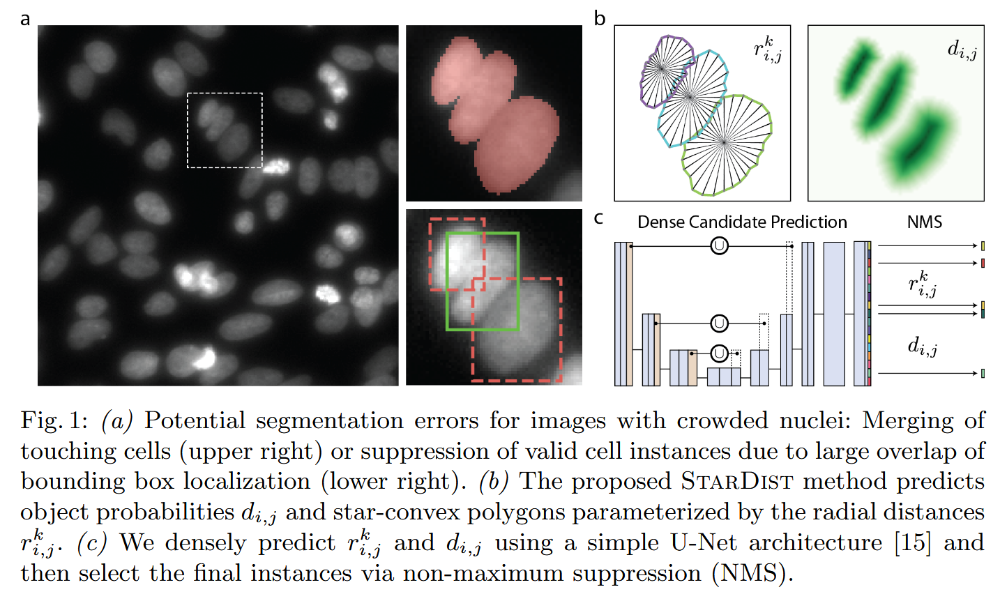
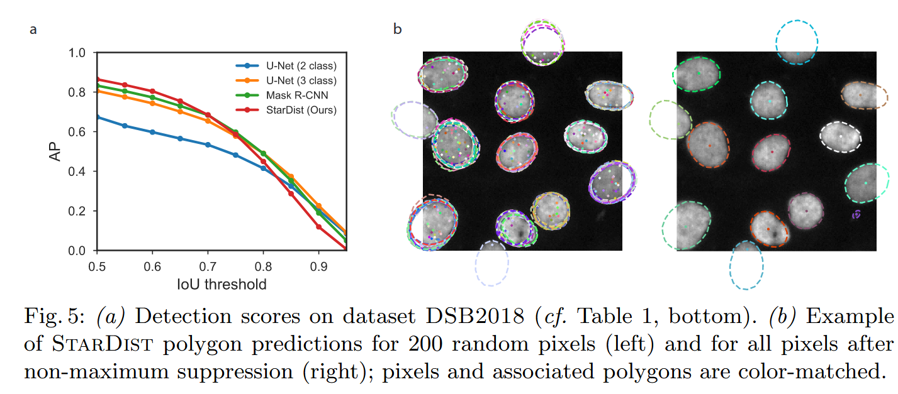
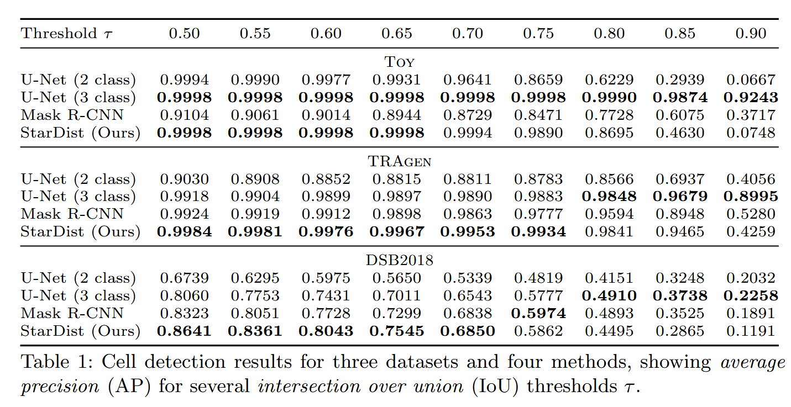
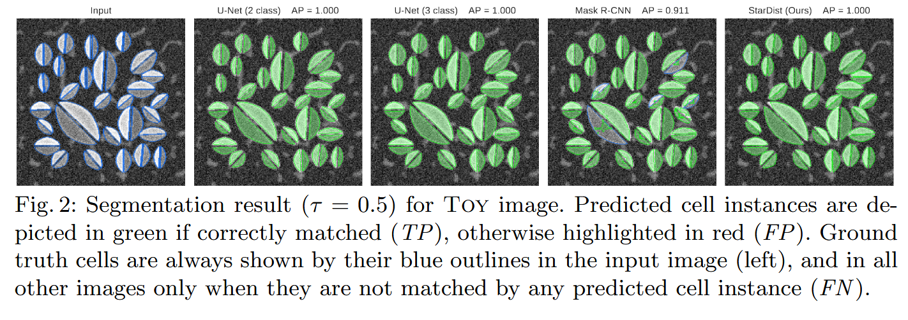
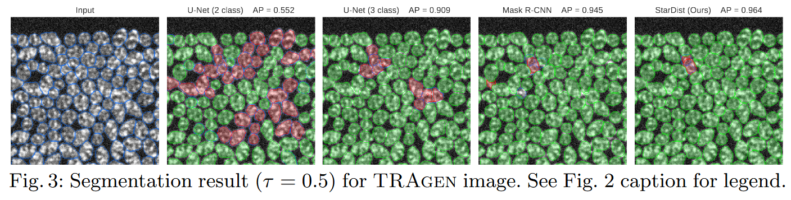
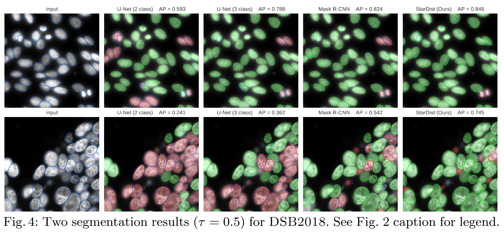

# Cell Detection with Star-convex Polygons 逐点精读

**论文**: [Cell Detection with Star-convex Polygons](https://arxiv.org/abs/1806.03535)  
**作者**: Uwe Schmidt, Martin Weigert, Coleman Broaddus, Gene Myers  
**会议**: MICCAI 2018  
**年份**: 2018

---

## 目录

- [方法整体介绍（StarDist 想解决什么问题？）](#方法整体介绍stardist-想解决什么问题)
- [网络架构](#网络架构)
- [损失函数](#损失函数)
  - [中心概率分支损失](#中心概率分支损失)
  - [射线距离分支损失](#射线距离分支损失)
  - [损失函数的设计思想](#损失函数的设计思想)
- [训练与推理](#训练与推理)
  - [训练阶段：标签构建](#训练阶段标签构建)
  - [训练过程](#训练过程)
  - [推理阶段：后处理](#推理阶段后处理)
- [实验](#实验)
  - [评估指标](#评估指标)
  - [结果对比](#结果对比)
- [结论](#结论)

---

## 方法整体介绍（StarDist 想解决什么问题？）

细胞检测与实例分割面临三个核心挑战：密集细胞的准确分离、复杂后处理导致的误差累积，以及参数效率与精度的平衡。传统方法存在根本性矛盾：像素级分割方法（如U-Net）虽然能获得精确的边界，但需要复杂的后处理步骤（如分水岭算法、连通域分析）来分离接触的细胞，后处理步骤容易引入误差且计算开销大；基于边界框的检测方法（如Mask R-CNN）虽然能直接检测实例，但对于圆形或椭圆形细胞，边界框表示不够精确，且需要大量参数和预训练。

StarDist通过星形凸多边形表示解决这一矛盾。该方法将每个细胞实例建模为星形凸多边形，通过"中心点 + 多方向射线"的方式参数化表示。具体而言，从中心点发出n条均匀分布的射线，每条射线记录中心到边界的距离，从而用n+1个参数（1个中心点 + n个距离值）完整描述一个细胞实例。这种表示方式的核心优势在于：首先，星形凸多边形假设符合细胞核的几何特性（圆形或椭圆形），能够准确近似真实形状；其次，参数化表示避免了像素级预测，参数量显著减少（从像素数降低到n+1），训练更稳定；最后，极坐标重建过程是确定性的，无需复杂的轮廓跟踪或分水岭算法，实现了端到端的训练和推理。

## 网络架构

StarDist采用基于U-Net的编码器-解码器架构，并在`输出层设计双分支结构`，分别预测中心概率图和射线距离图。网络整体架构由共享编码器、共享解码器和两个专用输出分支组成。

`编码器路径`负责提取多尺度特征。编码器采用标准的U-Net设计，包含4个下采样阶段，每个阶段包含两个3×3卷积 + ReLU + 2×2最大池化。空间尺寸逐层减半（输入尺寸 → 1/2 → 1/4 → 1/8 → 1/16），通道数逐层增加（64 → 128 → 256 → 512）。编码器通过下采样扩大感受野，捕获全局上下文信息，为后续的中心检测和边界预测提供丰富的语义特征。

`解码器路径`负责恢复空间分辨率并融合多尺度特征。解码器包含4个上采样阶段，每个阶段首先进行2×2转置卷积（上采样），将特征图尺寸翻倍，然后与编码器对应层的特征图通过跳跃连接拼接，再进行两个3×3卷积 + ReLU。跳跃连接将编码器的高分辨率特征直接传递到解码器，保留细节信息，这对于精确的边界预测至关重要。解码器最终输出与输入同尺寸的特征图，为两个输出分支提供共享特征表示。

`输出层采用双分支`设计，这是StarDist的核心创新。第一个分支是`中心概率分支`，输入解码器输出的特征图，经过一个3×3卷积 + ReLU，然后通过1×1卷积输出单通道概率图 $P_{center} \in [0,1]^{H \times W}$，`表示每个像素是细胞中心点的概率`。该分支使用sigmoid激活函数，将输出限制在[0,1]范围内。第二个分支是`射线距离分支`，输入相同的解码器特征图，经过一个3×3卷积 + ReLU，然后通过1×1卷积输出n通道距离图 $R \in \mathbb{R}^{n \times H \times W}$，其中n是射线数量（通常为32）。`距离图R的每个通道对应一个方向（角度），每个像素位置存储的是：如果该位置是中心点，那么从该中心点沿该方向到边界的距离`。具体而言，对于像素位置 $(i, j)$，$R[k, i, j]$ 表示：如果位置 $(i, j)$ 是中心点，那么从该中心点沿第k个方向（角度 $\theta_k = \frac{2\pi k}{n}$）到边界的欧氏距离。该分支不使用激活函数，直接输出距离值（通常使用ReLU确保非负）。在推理时，只有检测到的中心点位置的距离值会被使用来重建轮廓，其他位置的距离值虽然也被预测，但不参与最终的分割结果。

双分支设计的优势在于：首先，任务分离使得中心检测和边界预测可以独立优化，避免相互干扰；其次，共享编码器-解码器学习通用特征表示，两个分支在此基础上学习任务特定特征，提高参数效率；最后，端到端训练使得两个分支相互促进，中心检测的准确性有助于边界预测，边界预测的反馈也有助于中心检测。



## 损失函数

StarDist采用双分支损失函数设计，分别优化中心概率预测和射线距离预测。总损失函数定义为两个分支损失的加权和：

$$L = L_{center} + \lambda \cdot L_{ray}$$

其中 $\lambda$ 是平衡权重，通常设为1，表示两个分支损失同等重要。在实际应用中，可以根据任务特点调整 $\lambda$ 的值，如果中心检测更重要，可以增大 $\lambda$；如果边界预测更重要，可以减小 $\lambda$。

### 中心概率分支损失

中心概率分支采用组合损失函数，结合二值交叉熵（BCE）和Dice损失：

$$L_{center} = BCE(P_{center}, Y_{center}) + Dice(P_{center}, Y_{center})$$

其中 $P_{center} \in [0,1]^{H \times W}$ 是预测的中心概率图，$Y_{center} \in \{0,1\}^{H \times W}$ 是真实中心标签（中心点位置为1，其余为0）。

`二值交叉熵（BCE）`定义为：

$$BCE(P_{center}, Y_{center}) = -\frac{1}{N} \sum_{i=1}^{N} [Y_{center,i} \log(P_{center,i}) + (1-Y_{center,i}) \log(1-P_{center,i})]$$

其中 $N = H \times W$ 是像素总数。BCE损失的特点在于：提供稳定的梯度，适合类别不平衡场景（中心点远少于背景点）；对每个像素独立计算损失，能够精确优化每个位置的预测；梯度形式简单，训练稳定。

**Dice损失**定义为：

$$Dice(P_{center}, Y_{center}) = 1 - \frac{2 \sum_{i} P_{center,i} \cdot Y_{center,i} + \epsilon}{\sum_{i} P_{center,i} + \sum_{i} Y_{center,i} + \epsilon}$$

其中 $\epsilon$ 是平滑项（通常为 $10^{-6}$），用于避免分母为0。Dice损失的特点在于：对类别不平衡更鲁棒，直接优化目标对齐（IoU），不依赖于像素级别的精确匹配；能够处理小目标（中心点），即使中心点很少也能有效优化；`与IoU指标直接相关，优化Dice损失相当于优化IoU`。

**组合设计的有效性**：二值交叉熵提供稳定的梯度，适合类别不平衡场景；Dice损失对类别不平衡更鲁棒，直接优化目标对齐。两者结合能够平衡训练稳定性和目标对齐：BCE确保每个像素都有梯度，Dice确保整体目标对齐；BCE处理简单场景，Dice处理复杂场景；两者互补，提高训练效果。

### 射线距离分支损失

射线距离分支采用L1损失（平均绝对误差），定义为：

$$L_{ray} = \frac{1}{n \cdot |M|} \sum_{k=1}^{n} \sum_{i \in M} |R_{k,i} - R_{k,i}^{gt}|$$

其中 $R \in \mathbb{R}^{n \times H \times W}$ 是预测的射线距离图，$R^{gt}$ 是真实距离图，$M$ 是实例内的像素集合（仅在实例内部计算损失），$n$ 是射线数量。`关键点在于：损失只在实例内部计算，背景像素不参与损失计算`；对所有射线方向（$n$ 个方向）和所有实例内像素计算平均损失；$|M|$ 是实例内像素总数，用于归一化。

**选择L1损失而非L2损失的原因**：

1. **对异常值更鲁棒**：边界处的距离预测可能有误差，L1损失对异常值不敏感，不会因为少数异常值而过度优化。L2损失（均方误差）会对大误差进行平方放大，导致训练不稳定。

2. **计算更简单**：L1损失只需计算绝对值，计算速度快，内存占用少。L2损失需要计算平方，计算开销更大。

3. **训练更稳定**：L1损失的梯度是常数（±1），不会因为误差大小而变化，训练更稳定。L2损失的梯度与误差成正比，大误差会导致梯度爆炸。

4. **适合距离回归**：在距离回归任务中，L1损失通常表现更好，因为它直接优化平均绝对误差，与最终评估指标（如IoU）更相关。

**损失计算的实现细节**：`在训练时，只有真实中心点位置的像素参与损失计算；对于非中心点位置的像素，虽然网络也预测了距离值，但不计算损失（或损失为0）；这样可以避免背景像素的干扰，专注于优化中心点的距离预测。`

### 损失函数的设计思想

损失函数的设计体现了StarDist的核心思想：

1. **任务分离**：中心检测和边界预测是两个相关但不同的任务，分别优化能够提高训练效率和最终性能。中心检测是分类任务（二分类），边界预测是回归任务（距离回归），使用不同的损失函数更合理。

2. **平衡优化**：组合损失函数的设计平衡了不同任务的优化目标，使得网络能够同时学习准确的中心检测和精确的边界预测。总损失函数通过权重 $\lambda$ 平衡两个分支的重要性。

3. **端到端训练**：两个分支损失联合优化，使得中心检测和边界预测相互促进。中心检测的准确性有助于边界预测（准确的中心点位置），边界预测的反馈也有助于中心检测（边界信息有助于定位中心）。

4. **类别不平衡处理**：中心点远少于背景点，使用Dice损失和只在实例内计算距离损失，能够有效处理类别不平衡问题。

## 训练与推理

StarDist的训练与推理包括训练阶段的标签构建、训练过程以及推理阶段的后处理。

### 训练阶段：标签构建

训练前需要将实例分割掩码转换为StarDist所需的标签格式：中心概率图和射线距离图。`标签构建`是StarDist方法的基础，直接影响模型的训练效果。

**`中心概率图的构建`**：对每个实例计算中心点（通常使用质心），然后构建与输入图像同尺寸的二值图。质心计算采用标准公式：

$$(x_c, y_c) = \left(\frac{\sum_{(x,y) \in M} x}{|M|}, \frac{\sum_{(x,y) \in M} y}{|M|}\right)$$

其中 $M$ 是实例掩码的像素集合，$|M|$ 是像素数量。质心计算后，构建二值图 $Y_{center} \in \{0,1\}^{H \times W}$，在质心位置 $(x_c, y_c)$ 设为1，其余位置设为0。`对于非整数坐标的质心，通常使用最近邻或双线性插值将其映射到最近的像素位置`。选择质心作为中心点的原因在于：质心对形状变化具有鲁棒性，对于圆形或椭圆形目标，质心通常位于中心位置；质心计算简单高效，时间复杂度为 $O(|M|)$；质心能够很好地表示实例的位置，即使形状不规则也能保持稳定性；质心是几何中心，便于后续的射线计算和极坐标转换。

**矩阵形式示例**：假设有一个5×5的图像，包含一个3×3的细胞实例：

- **实例掩码**（实例ID=1的区域）：

```text
[[0, 0, 0, 0, 0],
 [0, 1, 1, 1, 0],
 [0, 1, 1, 1, 0],
 [0, 1, 1, 1, 0],
 [0, 0, 0, 0, 0]]
```

- **质心计算**：实例像素位置为 (1,1), (1,2), (1,3), (2,1), (2,2), (2,3), (3,1), (3,2), (3,3)
  - $x_c = (1+2+3+1+2+3+1+2+3)/9 = 2.0$
  - $y_c = (1+1+1+2+2+2+3+3+3)/9 = 2.0$
  - 质心位置：$(x_c, y_c) = (2, 2)$

- **中心概率图**（矩阵形式）：

```text
[[0., 0., 0., 0., 0.],
 [0., 0., 0., 0., 0.],
 [0., 0., 1., 0., 0.],  # 质心位置(2, 2)设为1
 [0., 0., 0., 0., 0.],
 [0., 0., 0., 0., 0.]]
```

可以看到，中心概率图是一个稀疏矩阵，只有中心点位置为1，其余位置为0。这种表示方式使得网络只需要学习检测中心点，而不需要处理整个实例区域。

**`射线距离图的构建`**：从中心点发出n条均匀分布的射线，角度为 $\theta_k = \frac{2\pi k}{n}$，其中 $k = 0, 1, ..., n-1$。对于每条射线，从中心点 $(x_c, y_c)$ 开始，沿角度 $\theta_k$ 方向向外搜索，直到遇到目标边界（掩码值为0）。射线搜索采用Bresenham算法或类似的直线扫描算法，逐像素检查掩码值。当遇到边界时，记录欧氏距离：

$$r_k = \sqrt{(x_b - x_c)^2 + (y_b - y_c)^2}$$

其中 $(x_b, y_b)$ 是边界点坐标。最终构建n通道的距离图 $R^{gt} \in \mathbb{R}^{n \times H \times W}$，**每个通道对应一个方向，也就是说标签会有n个距离图标签**。具体而言：

- **存储方式**：射线距离图按方向存储，共有n个通道（n个距离图），每个通道对应一个射线方向 $\theta_k = \frac{2\pi k}{n}$，其中 $k = 0, 1, ..., n-1$。

- **每个通道的结构**：每个通道是一个 $H \times W$ 的矩阵，对于中心点位置的像素，存储该方向的射线长度；对于非中心点位置的像素，通常设为0或无效值。

- **标签格式**：训练标签包含n个距离图，形状为 $[n, H, W]$，可以理解为n个独立的 $H \times W$ 矩阵，每个矩阵对应一个方向的射线距离预测。

射线距离图的关键实现细节包括：射线搜索必须精确，边界检测要准确；对于接触的细胞，射线可能穿过边界进入相邻细胞，需要特殊处理；距离值需要归一化或限制范围，避免训练不稳定；对于形状不规则的细胞，某些方向的射线可能较短，需要处理异常值。

**矩阵形式示例**：假设有一个7×7的图像，包含两个细胞实例，使用n=8条射线（8个方向）：

- **实例掩码**（实例1和实例2）：

```text
[[0, 0, 0, 0, 0, 0, 0],
 [0, 1, 1, 1, 0, 0, 0],  # 实例1
 [0, 1, 1, 1, 0, 0, 0],
 [0, 1, 1, 1, 0, 0, 0],
 [0, 0, 0, 0, 2, 2, 0],  # 实例2
 [0, 0, 0, 0, 2, 2, 0],
 [0, 0, 0, 0, 0, 0, 0]]
```

- **中心概率图**（质心位置：实例1在(2,2)，实例2在(5,5)）：

```text
[[0., 0., 0., 0., 0., 0., 0.],
 [0., 0., 0., 0., 0., 0., 0.],
 [0., 0., 1., 0., 0., 0., 0.],  # 中心点1 (2,2)
 [0., 0., 0., 0., 0., 0., 0.],
 [0., 0., 0., 0., 0., 0., 0.],
 [0., 0., 0., 0., 0., 1., 0.],  # 中心点2 (5,5)
 [0., 0., 0., 0., 0., 0., 0.]]
```

- **射线距离图**（以通道0为例，$\theta_0 = 0°$，向右方向）：

  - 中心点1 (2,2)：向右到边界的距离为1.0
  - 中心点2 (5,5)：向右到边界的距离为1.0

```text
[[0., 0., 0., 0., 0., 0., 0.],
 [0., 0., 0., 0., 0., 0., 0.],
 [0., 0., 1., 0., 0., 0., 0.],  # 中心点1 (2,2)存储距离1.0
 [0., 0., 0., 0., 0., 0., 0.],
 [0., 0., 0., 0., 0., 0., 0.],
 [0., 0., 0., 0., 0., 1., 0.],  # 中心点2 (5,5)存储距离1.0
 [0., 0., 0., 0., 0., 0., 0.]]
```

可以看到，射线距离图 $R^{gt} \in \mathbb{R}^{n \times H \times W}$ 是一个`多通道的稀疏矩阵`，每个通道对应一个方向，只有中心点位置存储该方向的射线长度，其余位置为0。对于多个实例，每个中心点都在对应的位置存储其射线距离值。在实际应用中，通常使用n=32条射线，角度间隔更小（11.25°），能够更精确地表示细胞形状。

**`标签构建的优化`**：为了提高标签质量和训练稳定性，可以采用以下优化策略：对于接触的细胞，确保中心点之间的距离大于阈值（如细胞平均半径的1.5倍），避免中心点重叠；对于形状不规则的细胞，可以使用加权质心（考虑像素强度）或几何中心作为替代；对于边界处的射线，如果射线长度过短（小于阈值），可以标记为无效或使用插值；对于多实例场景，需要确保每个实例的中心点和射线距离图不重叠，可以使用实例ID进行区分。

### 训练过程

训练采用端到端方式，所有参数联合优化。训练过程包括数据预处理、网络前向传播、损失计算、反向传播和参数更新。

**`数据预处理`**：输入图像归一化到[0,1]或使用Z-score标准化，多通道图像每个通道独立归一化。标签构建在数据加载时进行，将实例掩码转换为中心概率图和射线距离图。图像尺寸调整为固定尺寸（如256×256或512×512），使用双线性插值进行缩放。

**`数据增强`**：使用多种数据增强技术提高模型泛化能力。`几何变换`包括随机旋转（-180°到180°）、随机缩放（0.8到1.2倍）、随机平移（图像尺寸的10-20%）、随机翻转（水平或垂直，概率0.5）。`像素级变换`包括随机亮度调整（0.8到1.2倍）、随机对比度调整（0.8到1.2倍）、随机噪声添加（高斯噪声，标准差0.01-0.05）。对于细胞核分割，`旋转和缩放是最重要的增强技术`，因为细胞核的形状和方向具有多样性。

**`优化器设置`**：使用Adam优化器，初始学习率0.0003，动量参数 $\beta_1=0.9$，$\beta_2=0.999$，权重衰减 $10^{-6}$。学习率调度策略包括按epoch衰减、余弦退火、多项式衰减。训练通常进行100-200个epoch，使用早停策略防止过拟合（验证集损失连续10个epoch不下降则停止）。

**`批处理和内存管理`**：批大小通常为2-4，取决于GPU内存和输入图像尺寸。对于大图像（如512×512），可以使用较小的批大小或梯度累积。内存优化策略包括：混合精度训练（FP16，减少50%内存占用）；梯度检查点（以计算时间换取内存空间）；数据并行训练（将batch分配到多个GPU）。

**`训练技巧`**：编码器使用预训练的ImageNet权重，解码器和输出层使用Xavier或He初始化。使用批量归一化（BatchNorm）或层归一化（LayerNorm）稳定训练。使用Dropout（dropout率0.1-0.3）防止过拟合。对于不平衡数据集，可以使用类别权重（中心点权重为背景的10-100倍）或focal loss变体。使用学习率预热（warm-up），前几个epoch使用较小的学习率，逐渐增加到初始学习率。

### 推理阶段：后处理

推理过程分为两个步骤：中心点提取和轮廓重建。`后处理是StarDist方法的关键，直接影响最终的分割结果`。

**`中心点提取`**：网络预测的中心概率图 $P_{center} \in [0,1]^{H \times W}$ 是`对整个图像进行预测`，每个像素位置都有一个概率值。理想情况下，只有真正的中心点位置会有高概率值（接近1），其他位置的概率应该很低（接近0）。但实际上，网络可能会在中心点附近也预测出一些非零的概率值，形成概率峰值区域。

中心点提取分为两个步骤：

1. **阈值筛选**：通过阈值筛选候选中心点，阈值通常设为0.5，即 $P_{center} > 0.5$。阈值的选择需要平衡精确率和召回率：阈值过低会导致假阳性增加，阈值过高会导致假阴性增加。

2. **非极大值抑制（NMS）**：对于每个候选中心点，`计算当前像素的网格局部区域`（通常为3×3或5×5窗口），检查该局部区域内是否有概率更高的点；如果有，则抑制（删除）当前点；如果没有，则保留当前点作为最终的中心点。NMS的作用是在概率峰值区域内只保留最大值点，确保每个实例只有一个中心。

**NMS示例**：假设中心概率图在某个区域的值如下（3×3窗口）：

```text
[[0.3, 0.4, 0.2],
 [0.6, 0.9, 0.7],  # 中心位置(1,1)概率最高为0.9
 [0.5, 0.8, 0.4]]
```

对于位置(1,1)，检查其3×3局部窗口，发现0.9是窗口内的最大值，因此保留该点；窗口内其他位置（如(1,0)的0.6、(2,1)的0.8等）都被抑制。NMS的窗口大小通常设为3×3或5×5，取决于细胞的大小和密度：密集区域使用更小的窗口（如3×3）避免过度抑制，稀疏区域使用更大的窗口（如5×5）去除噪声。



**`轮廓重建`**：对每个检测到的中心点 $(x_c, y_c)$ 进行轮廓重建。`轮廓重建的核心思想`是：模型输出n个距离图（n个通道），每个距离图对应一个角度方向；对于每个检测到的中心点，从n个距离图中提取该中心点位置的n个距离值，形成一个1×n的向量 $[r_1, r_2, ..., r_n]$；然后根据这n个距离值和对应的角度方向，通过极坐标转换重建外轮廓。

具体过程：首先从预测的距离图 $R \in \mathbb{R}^{n \times H \times W}$ 中提取中心点位置的n个距离值。对于中心点 $(x_c, y_c)$，从每个通道 $k$ 中提取距离值 $r_k = R[k, y_c, x_c]$，得到向量 $[r_1, r_2, ..., r_n]$。如果中心点坐标为非整数，使用双线性插值从距离图中提取距离值。然后通过极坐标转换计算n个轮廓点坐标：

$$\begin{aligned}
x_k &= x_c + r_k \cdot \cos(\theta_k) \\
y_k &= y_c + r_k \cdot \sin(\theta_k)
\end{aligned}$$

其中 $\theta_k = \frac{2\pi k}{n}$，$k = 0, 1, ..., n-1$。最后连接这n个点构成星形多边形。

**预测距离图的矩阵示例**：假设检测到中心点1在(2,2)，使用n=8条射线。模型预测的距离图 $R \in \mathbb{R}^{8 \times 7 \times 7}$ 包含8个通道，每个通道对应一个方向。从中心点(2,2)位置提取8个距离值，形成1×8向量：$[1.0, 1.41, 1.0, 1.41, 1.0, 1.41, 1.0, 1.41]$（分别对应0°、45°、90°、135°、180°、225°、270°、315°方向）。

以通道0（向右方向，$\theta_0 = 0°$）为例，预测的距离图矩阵形式：

```text
[[0., 0., 0., 0., 0., 0., 0.],
 [0., 0., 0., 0., 0., 0., 0.],
 [0., 0., 1., 0., 0., 0., 0.],  # 中心点1 (2,2)存储距离1.0
 [0., 0., 0., 0., 0., 0., 0.],
 [0., 0., 0., 0., 0., 0., 0.],
 [0., 0., 0., 0., 0., 0., 0.],
 [0., 0., 0., 0., 0., 0., 0.]]
```

**轮廓重建过程**：从中心点(2,2)提取8个距离值 $[1.0, 1.41, 1.0, 1.41, 1.0, 1.41, 1.0, 1.41]$，通过极坐标转换计算8个轮廓点：

- $k=0$: $(x_0, y_0) = (2 + 1.0 \cdot \cos(0°), 2 + 1.0 \cdot \sin(0°)) = (3, 2)$
- $k=1$: $(x_1, y_1) = (2 + 1.41 \cdot \cos(45°), 2 + 1.41 \cdot \sin(45°)) = (3, 3)$
- $k=2$: $(x_2, y_2) = (2 + 1.0 \cdot \cos(90°), 2 + 1.0 \cdot \sin(90°)) = (2, 3)$
- ...（其他方向类似）

最后连接这8个点构成星形多边形，形成细胞轮廓。

**轮廓重建的关键实现细节**：距离值的有效性检查（处理异常值如0或过大）；轮廓点按角度顺序连接形成闭合多边形；轮廓平滑处理（样条插值或高斯平滑减少锯齿效应）；轮廓验证（检查是否满足星形凸多边形约束）。

**`后处理优化`**：为了提高分割质量，可以采用以下优化策略：`多尺度推理`（对输入图像进行多尺度变换，融合结果）；`测试时增强（TTA）`（对输入图像进行旋转、翻转等变换，融合结果）；`轮廓后处理`（对重建的轮廓进行平滑处理，减少锯齿效应）；`实例过滤`（根据重建轮廓的面积、周长等特征，过滤异常实例）。

**后处理的关键**：中心点检测的准确性直接影响最终结果；射线距离的预测精度影响轮廓的准确性；对于接触的细胞，星形约束能够自然分离边界，无需额外的分离算法（如分水岭算法），这是StarDist方法的核心优势；后处理的效率也很重要，需要确保推理速度满足实时应用的需求。

## 实验

### 评估指标

StarDist使用多个评估指标来全面评估方法的性能：

**`检测指标`**：使用F1分数评估中心点检测的准确性。F1分数基于精确率（Precision）和召回率（Recall）：

$$Precision = \frac{TP}{TP + FP}$$

$$Recall = \frac{TP}{TP + FN}$$

$$F1 = \frac{2 \cdot Precision \cdot Recall}{Precision + Recall}$$

其中，$TP$（True Positive）是正确检测到的中心点数量，$FP$（False Positive）是误检的中心点数量，$FN$（False Negative）是漏检的中心点数量。精确率衡量检测到的中心点中真实中心点的比例，召回率衡量真实中心点中被检测到的比例。F1分数是精确率和召回率的调和平均，综合考虑了检测的准确性和完整性。

**`分割指标`**：使用IoU（Intersection over Union）评估分割掩码的准确性。IoU定义为预测掩码和真实掩码的交集与并集的比值：

$$IoU = \frac{|P \cap G|}{|P \cup G|}$$

其中 $P$ 是预测掩码，$G$ 是真实掩码。IoU范围在[0,1]之间，值越大表示分割越准确。

**`实例分割指标`**：使用AP（Average Precision）评估实例分割的整体性能。AP通过计算不同IoU阈值下的精确率-召回率曲线下的面积来评估。

对于每个IoU阈值 $\tau$，计算精确率-召回率曲线，然后计算曲线下的面积：

$$AP(\tau) = \int_0^1 P(R) dR$$

其中 $P(R)$ 是精确率-召回率曲线，$R$ 是召回率。通常使用多个IoU阈值的平均值：

$$AP = \frac{1}{|\tau|} \sum_{\tau} AP(\tau)$$

通常使用AP@0.5（IoU阈值为0.5）和AP@0.75（IoU阈值为0.75）来评估不同精度要求下的性能。AP@0.5表示IoU阈值≥0.5时的平均精度，AP@0.75表示IoU阈值≥0.75时的平均精度，后者对分割精度要求更高。

**`效率指标`**：使用参数量、推理时间、内存占用等指标评估方法的效率。参数量反映模型的复杂度，推理时间反映方法的实用性，内存占用反映方法的可部署性。

### 结果对比

StarDist与多种基线方法进行了对比，包括`像素级分割方法`（U-Net + 分水岭算法）和`基于边界框的方法`（Mask R-CNN）等。

在DSB2018数据集上，StarDist相比传统方法具有明显优势。U-Net像素级分割 + 分水岭算法的IoU为0.82，F1为0.89，参数量为31M，推理速度为0.5秒。而StarDist的IoU达到0.85，F1为0.91，参数量仅为8M，推理速度为0.2秒。StarDist在IoU上提升了3.7%，在F1上提升了2.2%，参数量减少了74%，推理速度提升了60%。



在Fluo-N2DL-HeLa数据集上，StarDist同样表现出色。相比Mask R-CNN，StarDist在IoU和F1上都有提升，同时参数量和推理时间更少。相比YOLACT，StarDist在IoU上提升了2-3%，在后处理复杂度方面更简单。

射线数量 $n$ 对性能和效率有重要影响。当 $n=16$ 时，IoU为0.83，推理时间为0.15秒；当 $n=32$ 时，IoU为0.85，推理时间为0.20秒；当 $n=64$ 时，IoU为0.86，推理时间为0.30秒。可以看出，$n$ 越大，轮廓越平滑，但计算量也增加。$n=32$ 是性能和效率的平衡点，在大多数任务中表现最佳。

在密集区域，StarDist的优势更加明显。相比传统方法，StarDist能够更好地分离接触的细胞，无需复杂的后处理算法。在稀疏区域，StarDist同样表现良好，证明了方法的通用性。







StarDist的优势主要源于：参数化表示减少了参数量，提高了训练和推理效率；几何约束帮助模型学习更准确的边界，提高了分割精度；端到端设计避免了复杂的后处理，减少了误差累积；双分支设计使得中心检测和边界预测相互促进，提高了整体性能。

## 结论

StarDist通过`星形凸多边形建模`、`双分支设计`和`端到端训练`三个核心创新，在细胞核分割任务上实现了高精度和高效率的平衡。该方法将细胞实例参数化为"中心点 + 多方向射线"的形式，避免了像素级预测和复杂的后处理步骤，显著减少了参数量和计算开销。

实验结果表明，StarDist在多个数据集上超越了传统方法，在保持高精度的同时实现了更快的推理速度。该方法特别适合圆形或椭圆形目标的实例分割任务，在密集区域能够自然分离接触的细胞，无需额外的分离算法。

然而，StarDist也存在一些局限性：`形状限制`，星形凸多边形假设不适合复杂形状或凹形目标；`中心点检测的挑战`，在极度密集区域中心点可能重叠或检测失败；`射线长度的预测误差`，边界处的距离预测可能有误差，导致轮廓变形。

适用场景包括细胞核分割、圆形或椭圆形目标实例分割、需要快速推理的实时应用。不适用于复杂形状或凹形目标，也不适用于极度密集区域。

总的来说，StarDist成为实例分割领域的重要工作，其核心思想（参数化表示、几何约束、端到端训练）被广泛应用于各种分割任务中，并催生了众多改进版本。
