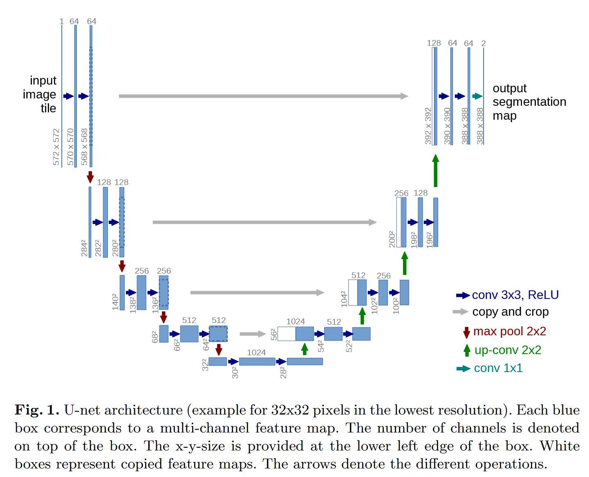
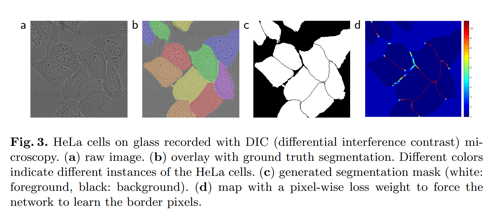
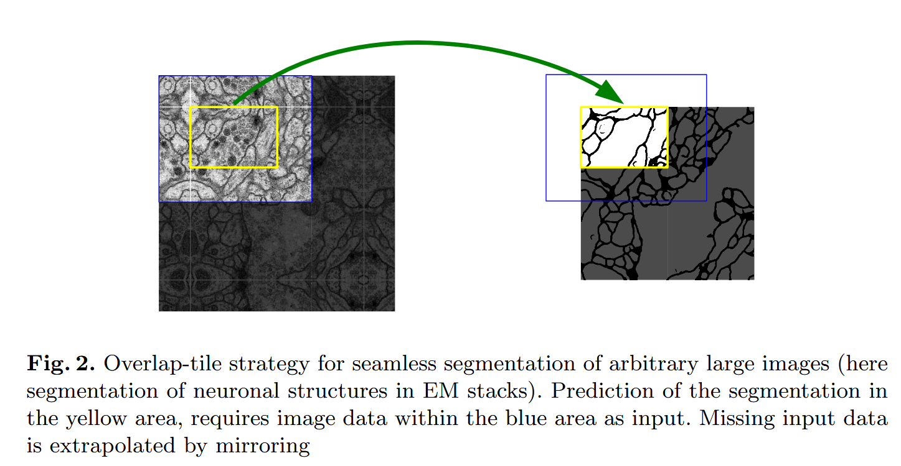
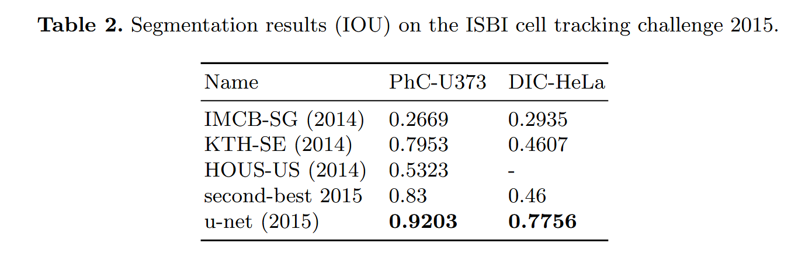

# U-Net: Convolutional Networks for Biomedical Image Segmentation 逐点精读

**论文**: [U-Net: Convolutional Networks for Biomedical Image Segmentation](https://arxiv.org/abs/1505.04597)  
**作者**: Olaf Ronneberger, Philipp Fischer, Thomas Brox  
**会议**: MICCAI 2015  
**年份**: 2015

---

## 目录

- [方法整体介绍（UNet 想解决什么问题？）](#方法整体介绍unet-想解决什么问题)
- [网络架构](#网络架构)
- [损失函数](#损失函数)
- [训练策略](#训练策略)
- [推理策略](#推理策略)
- [实验对比](#实验对比)
- [结论](#结论)

---

## 方法整体介绍（UNet 想解决什么问题？）

医学图像分割面临两个核心挑战：语义理解与精确定位的矛盾，以及训练数据稀缺。传统CNN存在根本性矛盾：深层网络语义理解强但定位精度差，浅层网络定位精确但语义理解弱，无法同时获得语义信息和空间精度。

U-Net通过U形对称架构解决这一矛盾。编码器（下采样）捕获全局语义，解码器（上采样）恢复空间分辨率，跳跃连接将编码器的高分辨率特征直接传递到解码器，实现语义与细节的融合，从而在小数据集上同时保留"语义 + 空间精度"。

## 网络架构

U-Net采用对称的U形架构，由编码器（收缩路径）和解码器（扩展路径）组成。网络共23层，输入572×572，输出388×388（无填充卷积导致边界收缩）。

编码器路径负责捕获上下文。每层包含两个3×3卷积（无填充）+ ReLU + 2×2最大池化，空间尺寸逐层减半，通道数逐层翻倍（1→64→128→256→512→1024）。下采样扩大感受野，捕获全局语义信息。

解码器路径负责精确定位。每层首先进行2×2上卷积（转置卷积），将特征图尺寸翻倍、通道数减半，然后与编码器对应层的特征图拼接，再进行两个3×3卷积（无填充）+ ReLU。由于编码器使用无填充卷积，需要对编码器特征图进行裁剪以匹配尺寸。跳跃连接将编码器的高分辨率特征直接传递到解码器，实现语义与细节的融合。最后通过1×1卷积输出类别数。

具体来说，编码器第一层将572×572输入经过两个3×3卷积变为568×568，然后池化到284×284，同时保存568×568的特征图用于跳跃连接。第二层从284×284经过卷积变为280×280，池化到140×140。第三层从140×140变为136×136，池化到68×68。第四层从68×68变为64×64，池化到32×32。最深层从32×32经过两个卷积变为28×28，这是编码器的输出。解码器第一层将28×28上采样到56×56，与编码器第四层裁剪后的特征拼接，然后卷积到52×52。第二层上采样到104×104，与第三层特征拼接，卷积到100×100。第三层上采样到200×200，与第二层特征拼接，卷积到196×196。第四层上采样到392×392，与第一层特征拼接，卷积到388×388。最后通过1×1卷积输出类别数。

## 损失函数

U-Net采用加权像素级交叉熵损失函数，核心思想是给不同位置的像素分配不同的权重，让网络更关注重要的区域。损失函数定义为：

$$L = -\frac{1}{N} \sum_{i=1}^{N} w(x_i) \sum_{c=1}^{C} y_{i,c} \log(\hat{y}_{i,c})$$

其中 $w(x_i)$ 是像素权重，这是与标准交叉熵损失的关键区别。权重函数 $w(x)$ 有两个作用：处理类别不平衡和强调边界区域。

权重计算的核心思想是：距离边界越近的像素，权重越大。权重函数定义为：

$$w(x_i) = w_c(x_i) + w_0 \cdot \exp\left(-\frac{d(x_i)^2}{2\sigma^2}\right)$$

其中 $d(x_i)$ 是像素到最近边界的距离，$w_c(x_i)$ 是类别权重（前景权重大，背景权重小），第二项形成以边界为中心的高斯权重分布。实现时，先检测边界像素，然后计算每个像素到边界的距离，最后根据距离计算权重。

加权损失的优势在于：首先，通过类别权重处理类别不平衡，医学图像中背景像素远多于前景像素；其次，通过边界权重强调边界区域，边界对分割质量至关重要；最后，对于接触物体的分离，通过提高分离边界的权重，使网络能够准确分离接触的细胞。

在许多细胞分割任务中，同一类别的接触物体分离是一个关键挑战。当多个细胞紧密接触时，标准方法可能把它们预测成一个连通区域。U-Net通过加权损失解决这个问题：给接触细胞之间的边界区域（背景像素）更大的权重，让网络在训练时更关注这些关键分离边界，从而能够准确地将接触的细胞分离开来，即使它们属于同一类别。

## 训练策略

U-Net采用强大的数据增强策略，核心是弹性变形（elastic deformation）。弹性变形通过生成随机位移场对图像和标签同时进行变形，模拟生物组织的自然形变。具体实现是生成随机位移场 $D(x,y)$，每个位置的位移 $(\Delta x, \Delta y)$ 从高斯分布采样（标准差 $\sigma$ 通常为10-50像素），然后使用双线性插值对图像和标签同时变形。这种增强能够模拟生物组织形状变化，同时保证图像和标签的一致性，将少量标注数据（25张）扩充到数千张训练样本。

除了弹性变形，还使用随机旋转（-10°到10°）、随机缩放（0.9到1.1倍）、随机平移、随机灰度值变化等增强技术。对于生物医学图像，弹性变形是最重要的增强技术，因为它能够模拟生物组织在切片、固定、染色等过程中的自然形变。

训练采用端到端方式，所有参数联合优化。对于大图像，使用重叠平铺（overlap-tile）策略：由于网络输入固定（572×572），输出为388×388，边界会丢失92像素，因此将大图像切分成重叠的小块（重叠区域92像素），预测时对重叠区域取平均，避免边界效应。这种策略可以处理任意大小的输入图像，同时提高边界区域的分割质量。

## 推理策略

推理时，U-Net采用全卷积方式，可以处理任意大小的输入图像。对于大图像，使用重叠平铺（overlap-tile）策略：将图像切分成重叠的小块（输入572×572，重叠92像素），对每块进行预测（输出388×388），然后拼接结果，对重叠区域取平均或加权平均（距离块中心越近权重越大）。这种方法无需固定输入尺寸，重叠区域平滑边界，避免块效应，边界区域通过多次预测平均得到更准确的结果。

对于边界区域，由于网络输出尺寸小于输入尺寸，边界会丢失。可以采用镜像填充或复制填充来扩展输入图像，使得输出能够覆盖整个输入区域。镜像填充保持图像连续性，复制填充实现简单快速。最佳策略是扩充图像边缘后进行推理，对裁剪的图像取中心进行拼接，并进行中心融合或加权融合。

输出是像素级类别概率图，通过argmax或阈值得到最终分割掩码。二分类使用sigmoid激活和阈值（通常0.5），多分类使用softmax激活和argmax。U-Net推理速度快，在现代GPU上对512×512图像的分割时间不到一秒，优势源于全卷积设计无需滑动窗口，网络结构简单，可以批处理提高吞吐量。

## 实验对比

在ISBI 2012电子显微镜堆栈神经结构分割挑战赛中，U-Net超越了之前最好的滑动窗口方法。评估指标包括warping error（扭曲误差，衡量分割边界准确性）和rand error（Rand指数误差，衡量分割区域一致性）。U-Net的warping error为0.000352，rand error为0.0382，而滑动窗口方法的warping error为0.000420，rand error为0.0504。U-Net在warping error上提升了16.2%，在rand error上提升了24.2%。

数据集包含30张电子显微镜图像（512×512），标注了神经元结构边界。训练使用25张图像，测试使用5张图像。通过数据增强，训练样本从25张扩充到数千张，证明了U-Net在小数据集上的有效性以及弹性变形等数据增强技术的重要性。

相比滑动窗口方法，U-Net的优势在于：全卷积设计避免重复计算，提高推理效率；端到端训练学习最优特征表示；跳跃连接保留细节信息，提高边界精度；强大的数据增强提高泛化能力。这些优势使U-Net成为医学图像分割领域的里程碑式工作。

## 结论

U-Net的核心贡献在于三个方面：U形对称架构，通过编码器-解码器结构实现上下文捕获和精确定位；跳跃连接，将高分辨率特征直接传递到解码器，保留细节信息；强大的数据增强，特别是弹性变形，提高有限数据的利用效率。

该方法的优势在于架构简单、性能优异、速度快、通用性强。U形对称设计便于特征对齐和融合，跳跃连接实现语义与细节的完美结合，全卷积设计提高推理效率，适用于多种生物医学图像分割任务。

然而，U-Net也存在一些局限性：需要保存编码器中间特征，大图像内存消耗较大；感受野可能不足，无法捕获全局依赖关系；细小结构边界精度可能不足；对类别不平衡敏感。解决方案包括使用梯度检查点、混合精度训练、空洞卷积、注意力机制、边界增强损失等。

总的来说，U-Net通过创新的U形架构和跳跃连接设计，在小数据集上实现了高精度的医学图像分割，成为医学图像分割领域的里程碑式工作。尽管存在局限性，但其核心思想（编码器-解码器结构、跳跃连接、数据增强）仍然被广泛应用于各种分割任务中，并催生了众多改进版本。

