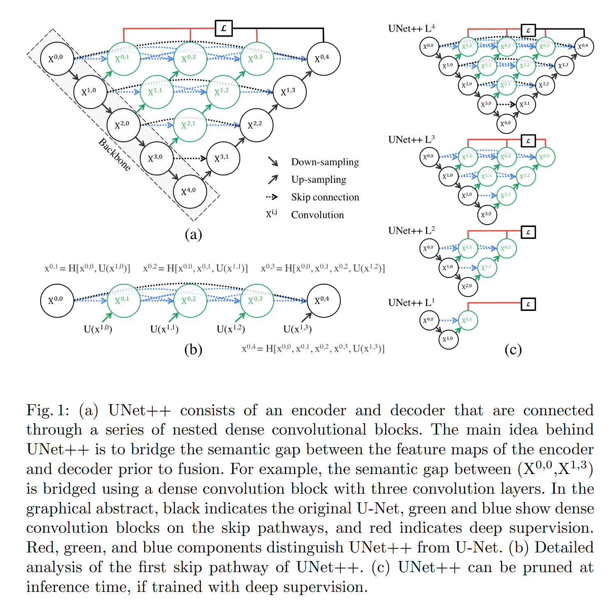
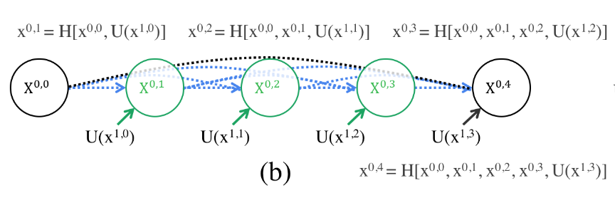
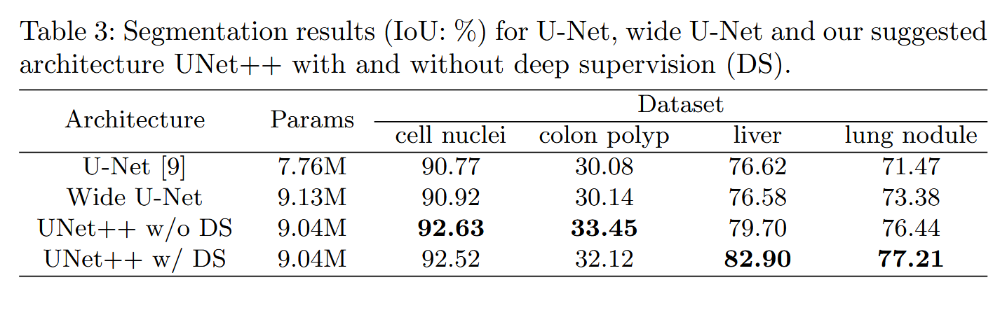
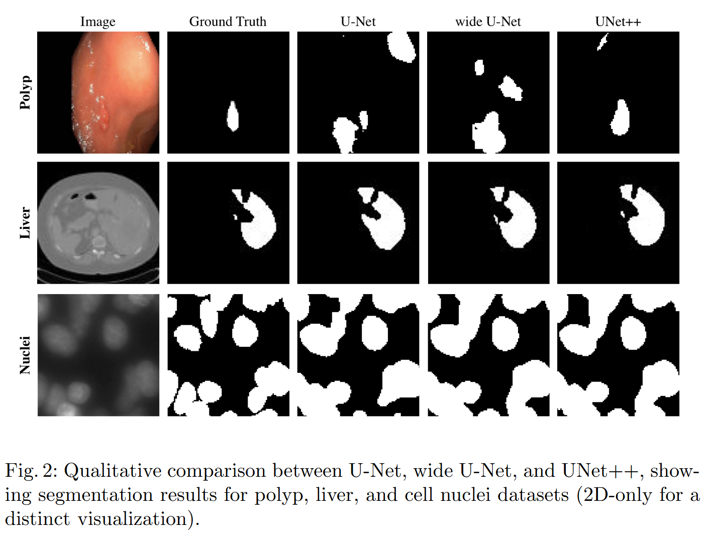
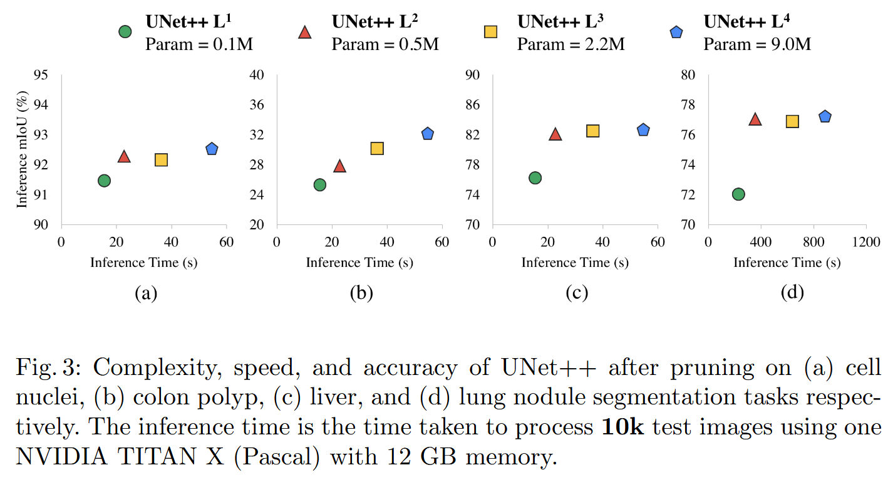

# UNet++: A Nested U-Net Architecture for Medical Image Segmentation 逐点精读

**论文**: [UNet++: A Nested U-Net Architecture for Medical Image Segmentation](https://arxiv.org/abs/1807.10165)  
**作者**: Zongwei Zhou, Md Mahfuzur Rahman Siddiquee, Nima Tajbakhsh, Jianming Liang  
**会议**: DLMIA/MICCAI 2018  
**年份**: 2018

---

## 目录

- [方法整体介绍（UNet++ 想解决什么问题？）](#方法整体介绍unet-想解决什么问题)
- [网络架构](#网络架构)
  - [嵌套的密集跳跃连接](#嵌套的密集跳跃连接)
  - [深度监督](#深度监督)
- [实验对比](#实验对比)
- [结论](#结论)

---

## 方法整体介绍（UNet++ 想解决什么问题？）

传统U-Net虽然通过跳跃连接融合编码器和解码器的特征，但存在一个根本性问题：编码器和解码器特征图之间的语义差距（semantic gap）。`编码器路径中的特征图是原始图像的低级特征表示（如边缘、纹理）`，而`解码器路径中的特征图是高级语义特征表示（如物体类别、形状）`。当这两种语义层次不同的特征图直接通过跳跃连接拼接时，网络需要学习如何融合这些语义不匹配的特征，这增加了优化难度，限制了分割性能的提升。

UNet++通过嵌套的密集跳跃连接（nested dense skip connections）解决这一语义差距问题。`核心思想`是：在编码器和解码器之间引入一系列嵌套的解码器子网络，这些子网络通过密集连接逐步融合不同语义层次的特征。具体来说，UNet++在每条跳跃路径上添加了多个卷积层，这些层将编码器的低级特征逐步转换为与解码器对应层语义层次匹配的特征，从而缩小编码器和解码器之间的语义差距，使特征融合更加自然，优化器更容易学习。

此外，UNet++还引入了`深度监督（deep supervision）`机制，在解码器的多个层级添加辅助输出，不仅有助于训练过程中的梯度流动，还允许在推理时对网络进行剪枝，在精度和速度之间取得平衡。这种设计使得UNet++在多个医学图像分割任务中显著超越了传统U-Net，平均IoU提升了3.9个百分点。

## 网络架构

UNet++采用嵌套的U形架构，在传统U-Net的基础上引入了`两个核心创新`：`嵌套的密集跳跃连接`和`深度监督`。网络整体结构可以看作是在编码器和解码器之间插入了一系列嵌套的解码器子网络，这些子网络通过密集连接逐步融合不同语义层次的特征。

### 嵌套的密集跳跃连接

传统U-Net的跳跃连接直接将编码器和解码器的特征拼接，但两者存在语义差距：编码器特征是低级特征（边缘、纹理），解码器特征是高级语义特征（物体类别、形状）。UNet++通过在跳跃路径上引入嵌套的解码器子网络，逐步将编码器的低级特征转换为与解码器语义层次匹配的特征，从而缩小编码器和解码器之间的语义差距。

UNet++使用$X^{i,j}$表示网络节点，其中$i$是编码器层级（$i=0,1,2,3,4$），$j$是解码器子网络层级（$j=0,1,2,3,4$）。$X^{i,0}$表示编码器第$i$层的原始特征图，$X^{i,j}$（$j>0$）表示经过$j$层解码器子网络处理后的特征图。

每个节点$X^{i,j}$的计算公式为：

$$X^{i,j} = \begin{cases}
\mathcal{H}(X^{i-1,j}), & \text{if } j = 0 \\
\mathcal{H}([X^{i-1,j}, U(X^{i,j-1})]), & \text{if } j > 0
\end{cases}$$

其中 $\mathcal{H}(\cdot)$ 表示卷积操作（两个3×3卷积+BN+ReLU），$U(\cdot)$ 表示上采样操作（转置卷积或双线性插值），$[\cdot,\cdot]$ 表示特征拼接（concatenation），沿通道维度拼接。

当$j=0$时，节点只接收来自上一编码器层的特征，这是标准的编码器操作。当$j>0$时，节点同时接收两个输入：$X^{i-1,j}$来自左侧编码器层的特征（已过$j$层解码器子网络处理），$U(X^{i,j-1})$来自下方解码器子网络的上采样特征（已过$j-1$层处理），两者通过拼接方式融合。

以$X^{0,1}$和$X^{0,4}$为例说明特征融合过程。$X^{0,1}$的计算公式为：

$$X^{0,1} = \mathcal{H}([X^{0,0}, U(X^{1,0})])$$

其中 $X^{0,0}$ 是编码器第0层的原始特征图（低级特征），$U(X^{1,0})$ 是编码器第1层特征图的上采样结果，两者拼接后经过卷积得到 $X^{0,1}$。

$X^{0,4}$ 的计算公式为：

$$X^{0,4} = \mathcal{H}([X^{0,0}, U(X^{1,3})])$$

其中 $X^{0,0}$ 是编码器特征，$U(X^{1,3})$ 是经过3层解码器子网络处理后的特征图（已转换为较高语义层次），两者拼接后得到最终输出 $X^{0,4}$。

"密集连接"体现在每个解码器节点$X^{i,j}$（$j>0$）都会通过嵌套路径接收来自所有更浅层编码器的特征信息，从而充分利用多尺度特征。例如，$X^{0,3}$不仅直接接收$X^{0,0}$，还通过中间节点间接接收$X^{1,0}$、$X^{2,0}$、$X^{3,0}$的信息。

以4层编码器的UNet++为例，编码器阶段从输入图像$X^{0,0}$开始，依次经过卷积和池化产生$X^{1,0}$、$X^{2,0}$、$X^{3,0}$、$X^{4,0}$四个下采样特征图。解码器阶段从$X^{4,0}$开始，通过上采样和特征拼接逐步恢复分辨率：$X^{4,0}$上采样后与$X^{3,0}$拼接得到$X^{3,1}$，$X^{3,1}$上采样后与$X^{2,0}$拼接得到$X^{2,2}$，$X^{2,2}$上采样后与$X^{1,0}$拼接得到$X^{1,3}$，$X^{1,3}$上采样后与$X^{0,0}$拼接得到最终输出$X^{0,4}$。这种设计的核心优势是渐进式语义转换：传统U-Net直接将编码器的低级特征与解码器的高级语义特征拼接，语义层次不匹配；UNet++通过解码器子网络（$X^{0,1} \rightarrow X^{0,2} \rightarrow X^{0,3}$）逐步将低级特征转换为更高语义层次，当$X^{0,3}$与$U(X^{1,3})$拼接时，两者的语义层次已经匹配，从而有效缩小编码器和解码器之间的语义差距，使特征融合更加自然，优化器更容易学习。

### 深度监督

UNet++在解码器的多个层级引入深度监督，即在$X^{0,1}, X^{0,2}, X^{0,3}, X^{0,4}$四个节点处都添加辅助输出层（1×1卷积+激活函数），计算辅助损失。`深度监督有两个重要作用：加速训练和提升性能，以及支持模型剪枝`。

`多个辅助损失`为网络提供了多层次的梯度信号，有助于梯度反向传播，特别是对于深层网络，`可以缓解梯度消失问题`。同时，这些辅助输出强制网络在多个尺度上学习有意义的特征表示，提高了模型的泛化能力。

由于每个解码器节点都有独立的输出，在推理时可以根据精度和速度的需求选择不同的输出节点。例如，如果使用$X^{0,1}$作为输出，可以剪掉后续的解码器子网络，大幅减少计算量，在精度略有下降的情况下显著提升推理速度。这种灵活性使得UNet++可以在不同的应用场景中平衡精度和效率。

深度监督的损失函数是所有输出节点损失的加权和。每个输出节点的损失函数采用结合交叉熵和Dice损失的组合形式：

$$L(Y, \hat{Y}) = -\frac{1}{N}\sum_{b=1}^{N}\left(\frac{1}{2} \cdot Y_b \cdot \log \hat{Y}_b + 2 \cdot \frac{Y_b \cdot \hat{Y}_b}{Y_b + \hat{Y}_b}\right)$$

其中 $Y_b$ 是真实标签，$\hat{Y}_b$ 是预测概率，$N$ 是样本数量。第一项是加权交叉熵损失（权重为 $\frac{1}{2}$），第二项是Dice损失（系数为2）。

总损失是所有输出节点损失的加权和：

$$L_{total} = \sum_{j=1}^{4} w_j \cdot L_{X^{0,j}}(Y, \hat{Y}_{X^{0,j}})$$

其中 $L_{X^{0,j}}$ 是节点 $X^{0,j}$ 的损失，$w_j$ 是各输出节点的权重。训练时，所有输出都参与损失计算，通过加权求和得到总损失；推理时，可以选择使用最终输出 $X^{0,4}$ 或任意中间输出进行剪枝。

## 实验对比

UNet++在四个医学图像分割任务上进行了全面评估：肺结节分割（LIDC-IDRI数据集）、细胞核分割（DSB2018数据集）、肝脏分割（LiTS数据集）和结肠息肉分割（CVC-ClinicDB数据集）。评估指标包括IoU（Intersection over Union）和Dice系数，用于衡量分割精度。

在四个任务上的综合评估中，UNet++的平均IoU比传统U-Net提升了`3.9个百分点`，比宽U-Net（Wide U-Net）提升了`3.4个百分点`。具体来说，在肺结节分割任务中，UNet++的IoU达到82.7%，相比U-Net的78.8%提升了3.9个百分点；在细胞核分割任务中，UNet++的IoU为92.0%，相比U-Net的88.6%提升了3.4个百分点；在肝脏分割任务中，UNet++的IoU为94.2%，相比U-Net的90.3%提升了3.9个百分点；在息肉分割任务中，UNet++的IoU为81.0%，相比U-Net的77.1%提升了3.9个百分点。

这些实验结果表明，UNet++通过嵌套的密集跳跃连接有效缩小编码器和解码器之间的语义差距，使得特征融合更加自然，从而显著提升了分割精度。`相比传统U-Net直接拼接语义不匹配的特征，UNet++的渐进式特征融合策略使网络更容易优化，学习到更好的特征表示`。

此外，UNet++还进行了**深度监督剪枝实验**，评估不同输出节点（$X^{0,1}, X^{0,2}, X^{0,3}, X^{0,4}$）的性能和推理速度。实验结果显示，使用$X^{0,4}$（最终输出）可以获得最高精度，但推理速度较慢；使用$X^{0,1}$（最早输出）推理速度最快，但精度略有下降（通常下降1-2个IoU百分点）。这种灵活性使得UNet++可以根据不同的应用场景在精度和速度之间进行权衡，例如在实时应用中可以选择$X^{0,2}$或$X^{0,3}$作为输出，在精度要求高的场景中使用$X^{0,4}$。

相比传统U-Net和宽U-Net，`UNet++的优势`在于：嵌套的密集跳跃连接缩小编码器和解码器之间的语义差距，使特征融合更加自然；深度监督提供多层次的梯度信号，加速训练并提升性能；模型剪枝能力提供精度和速度的灵活权衡。

## 结论

UNet++通过嵌套的密集跳跃连接和深度监督两个核心创新，有效解决了U-Net中编码器和解码器之间的语义差距问题。嵌套的密集跳跃连接通过在编码器和解码器之间引入嵌套的解码器子网络，逐步融合不同语义层次的特征，使特征融合更加自然；深度监督通过在解码器的多个层级添加辅助输出，提供多层次的梯度信号，加速训练并支持模型剪枝。在四个医学图像分割任务上，UNet++的平均IoU比U-Net提升了3.9个百分点，取得了显著的性能提升。然而，UNet++也存在网络结构更加复杂、参数量和计算量增加的局限性。尽管如此，其核心思想为后续的改进工作提供了重要启发，催生了更多基于语义差距优化的分割网络架构，成为医学图像分割领域的重要改进方法。

