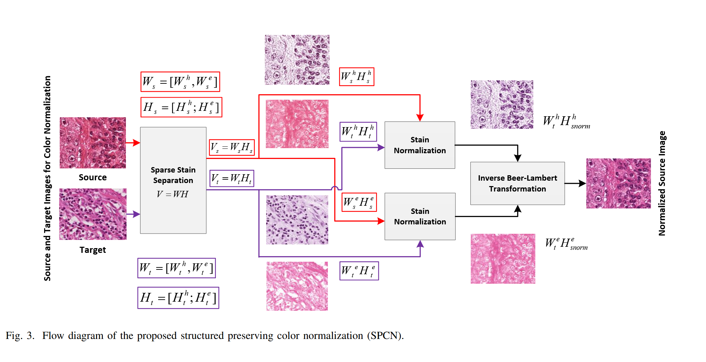
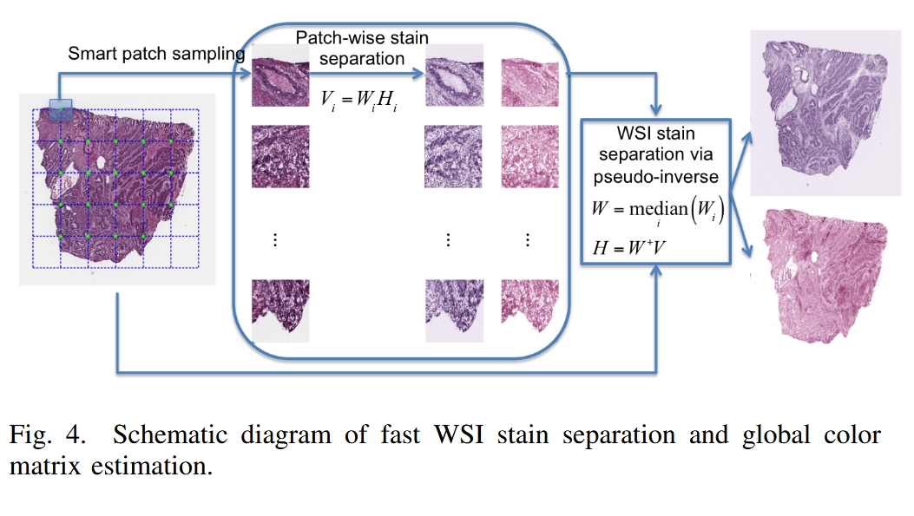
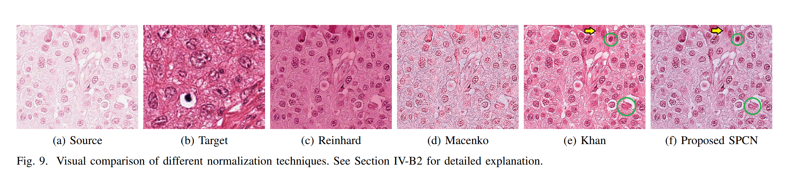

# Structure-Preserving Color Normalization and Sparse Stain Separation for Histological Images 逐点精读

**论文**: [Structure-Preserving Color Normalization and Sparse Stain Separation for Histological Images](https://arxiv.org/abs/1608.06534)  
**作者**: Abhishek Vahadane*, Tingying Peng*, Amit Sethi, Shadi Albarqouni, Lichao Wang, Maximilian Baust, Katja Steiger, Amit Sethi, Nassir Navab  
**会议**: IEEE Transactions on Medical Imaging  
**年份**: 2016

---

## 目录

- [方法整体介绍](#方法整体介绍)
  - [问题背景](#问题背景)
  - [Vahadane方法的核心创新](#vahadane方法的核心创新)
  - [方法流程](#方法流程)
- [方法细节](#方法细节)
  - [稀疏非负矩阵分解(SNMF)](#稀疏非负矩阵分解snmf)
  - [结构保持颜色归一化(SPCN)](#结构保持颜色归一化spcn)
  - [基于patch的加速颜色估计方法](#基于patch的加速颜色估计方法)
- [实验对比](#实验对比)
- [结论](#结论)

---

## 方法整体介绍

### 问题背景

在病理图像分析中，不同来源或批次的图像往往存在显著的染色风格差异，这种差异可能源于不同的染色设备、试剂批次、操作流程或扫描参数。`这种染色风格的不一致性会严重影响基于深度学习的病理图像分析模型的泛化能力`，因为模型在训练时学习到的特征往往包含染色风格信息，当应用到不同来源的图像时，模型性能会显著下降。

传统的颜色归一化方法(如Reinhard方法)虽然计算速度快，但存在一个根本性问题：`无法有效保持图像的组织结构信息`。这些方法通常基于简单的统计特征(如均值和方差)进行颜色变换，在改变染色风格的同时可能会扭曲或丢失重要的组织结构细节(如细胞核的形态、胞质的分布)。

### Vahadane方法的核心创新

Vahadane方法通过`三个核心贡献`解决上述问题：

1. **稀疏非负矩阵分解(SNMF)**：通过引入L1正则化项促进浓度矩阵的稀疏性，这不仅符合实际染色中大部分像素主要由一种染料染色的物理特性(如细胞核主要由苏木素染色，胞质主要由伊红染色)，还能解决不加正则化时矩阵分解有无数解的问题，使分解结果更加准确和稳定。

2. **结构保持颜色归一化(SPCN)**：通过SNMF分解成功分离了结构`H`和风格`W`，使得在改变染色风格的同时能够保持组织结构不变。这是Vahadane方法的核心创新，解决了传统方法无法有效保持图像组织结构信息的问题。

3. **基于patch的加速颜色估计方法**：为了加速SNMF分解过程，Vahadane方法提出了一种基于patch的加速策略，通过从图像中采样代表性patch来估计颜色基矩阵W，而不是在整个图像上进行分解，从而大幅提升计算效率。

### 方法流程

Vahadane方法的`核心思想`是：首先将RGB图像转换到光密度`OD`空间，然后在OD空间中通过SNMF分解将图像分解为两个关键组成部分：`染料颜色基矩阵 W`和`染料浓度矩阵 H`。

#### 第一步：RGB到OD空间转换

Vahadane方法的第一步是将RGB图像转换到光密度(OD)空间。这一转换基于`比尔-朗伯定律(Beer-Lambert Law)`，该定律描述了光通过染色组织时的吸收过程。根据比尔-朗伯定律，光密度定义为：

$$OD = -\log_{10}(I / I_0)$$

其中 $I$ 为RGB像素值(范围0-255)，$I_0 = 255$ 是参考光强。

RGB空间和OD空间的本质区别在于：RGB空间中光强与吸收的关系是乘性的，而OD空间中光强与吸收的关系是加性的。当两种染料混合时，在OD空间中总的光密度等于各染料光密度的线性叠加，即 $OD = OD_{H} + OD_{E}$，这种加性关系使得矩阵分解 $OD = W \cdot H$ 在数学上成为可能。

#### 第二步：SNMF分解

在OD空间中，通过SNMF分解将OD矩阵分解为 $OD \approx W \cdot H$，其中W是染料颜色基矩阵，H是染料浓度矩阵，实现了结构-风格分离。

#### 第三步：颜色标准化

在颜色标准化过程中，需要两个输入图像：`源图像(source image)`是待标准化的图像，`参考图像(reference image)`是作为标准的图像。Vahadane方法首先对源图像和参考图像分别执行SNMF分解，得到 $W_{source}$、$H_{source}$ 和 $W_{ref}$、$H_{ref}$，然后用参考图像的颜色基 $W_{ref}$ 替换源图像的颜色基 $W_{source}$，同时保持源图像的浓度信息 $H_{source}$，从而重构出标准化的图像：

$$OD_{normalized} = W_{ref} \cdot H_{source}$$

这样，标准化后的图像既保持了源图像的组织结构，又具有了参考图像的染色风格。

## 方法细节

### 稀疏非负矩阵分解(SNMF) <a id="稀疏非负矩阵分解snmf"></a>

在将RGB图像转换到OD空间后，Vahadane方法通过稀疏非负矩阵分解将OD矩阵分解为两个关键组成部分：`染料颜色基矩阵 W` 和 `染料浓度矩阵 H`。在H&E染色中，每个像素的颜色是苏木素(Hematoxylin)和伊红(Eosin)两种染料混合的结果，SNMF通过矩阵分解将这种混合分离，得到每种染料的颜色特征和浓度分布。

对于一张 $m \times n$ 的RGB图像，转换到OD空间后得到OD矩阵 $OD \in \mathbb{R}^{3 \times N}$，其中 $N = m \times n$ 是像素总数，3表示RGB三个通道。SNMF将OD矩阵分解为两个矩阵的乘积：

$$OD \approx W \cdot H$$

其中：

- `W` 是一个 $3 \times 2$ 的`染料颜色基矩阵`，表示两种染料在RGB三个通道的吸光特征。第一列 $\mathbf{w}_1 = [r_H, g_H, b_H]^T$ 表示Hematoxylin在RGB三个通道的吸光特征，第二列 $\mathbf{w}_2 = [r_E, g_E, b_E]^T$ 表示Eosin在RGB三个通道的吸光特征。
- `H` 是一个 $2 \times N$ 的`染料浓度矩阵`，表示每个像素的两种染料浓度。每一列 $\mathbf{h}_i = [h_{1i}, h_{2i}]^T$ 表示第 $i$ 个像素的Hematoxylin浓度 $h_{1i}$ 和Eosin浓度 $h_{2i}$。

**矩阵示例**：假设有一张 $100 \times 100$ 的图像($N = 10,000$ 个像素)，SNMF分解后的矩阵结构如下：

$$W = \begin{bmatrix}
r_H & r_E \\
g_H & g_E \\
b_H & b_E
\end{bmatrix} = \begin{bmatrix}
0.65 & 0.07 \\
0.70 & 0.99 \\
0.29 & 0.11
\end{bmatrix}, \quad H = \begin{bmatrix}
h_{1,1} & h_{1,2} & \cdots & h_{1,10000} \\
h_{2,1} & h_{2,2} & \cdots & h_{2,10000}
\end{bmatrix}$$

其中 $W$ 是 $3 \times 2$ 矩阵，$H$ 是 $2 \times 10000$ 矩阵。对于第 $i$ 个像素，其OD向量为：

$$\mathbf{o}_i = \begin{bmatrix} OD_{R,i} \\ OD_{G,i} \\ OD_{B,i} \end{bmatrix} = W \mathbf{h}_i = \begin{bmatrix} r_H & r_E \\ g_H & g_E \\ b_H & b_E \end{bmatrix} \begin{bmatrix} h_{1i} \\ h_{2i} \end{bmatrix} = h_{1i} \begin{bmatrix} r_H \\ g_H \\ b_H \end{bmatrix} + h_{2i} \begin{bmatrix} r_E \\ g_E \\ b_E \end{bmatrix}$$

>选择 $3 \times 2$ 矩阵的原因很直观：3行对应RGB三个通道，2列对应H&E染色中的两种主要染料。这是病理学中最常见的染色配置。

SNMF分解通过优化目标函数来实现，目标函数包含两部分：`重建误差项`和`L1正则化项`：

$$\min_{W,H} \|OD - WH\|_F^2 + \lambda \|H\|_1$$

其中 $\|OD - WH\|_F^2$ 是重建误差项，$\lambda \|H\|_1$ 是L1正则化项，用于促进浓度矩阵H的稀疏性，符合实际染色中大部分像素主要由一种染料染色的物理特性，同时解决不加正则化时矩阵分解有无数解的问题。

**`固定参数矩阵，迭代优化求解`**：由于同时优化W和H是一个非凸问题，Vahadane方法采用交替优化策略，即固定一个参数矩阵优化另一个，交替进行直到收敛。

**初始化**：W矩阵的初始化从训练集中随机选择两个像素的RGB光密度值，分别作为W的两列，即从图像中随机选择两个像素的OD向量作为初始的颜色基。

**交替优化步骤**：

1. **固定W，优化H(稀疏编码)**：给定颜色基矩阵W，优化浓度矩阵H。这是一个L1正则化的线性最小二乘问题：

$$\hat{H} = \arg\min_{H \geq 0} \frac{1}{2} \|OD - \hat{W}H\|_F^2 + \lambda\|H\|_1$$

由于W的列可能高度相关，Vahadane方法使用LARS算法求解，能够提供鲁棒且准确的解。

2. **固定H，优化W(字典学习)**：给定浓度矩阵H，优化颜色基矩阵W。此时目标函数为：

$$\hat{W} = \arg\min_{W \geq 0, \|W(:,j)\|_2^2 = 1} \frac{1}{2} \|OD - W\hat{H}\|_F^2$$

这是一个凸优化问题，使用块坐标下降法求解，保证收敛到全局最优解。约束条件 $\|W(:,j)\|_2^2 = 1$ 表示W的每一列的L2范数为1，即对颜色基进行归一化，确保不同图像之间的颜色基具有可比性。

3. **迭代更新**：重复步骤1和2，直到目标函数收敛或达到最大迭代次数。

**算法细节**：

**LARS算法(Least Angle Regression)**：LARS是一种用于求解L1正则化最小二乘问题的算法，特别适合处理高度相关的特征。LARS的核心思想是沿着最小角方向逐步增加非零系数，直到满足停止条件。

**LARS算法伪代码**(用于求解 $\min_{H \geq 0} \frac{1}{2} \|OD - WH\|_F^2 + \lambda\|H\|_1$)：

**算法：LARS求解稀疏编码**

**输入**：OD矩阵 $(3 \times N)$，W矩阵 $(3 \times 2)$，正则化系数 $\lambda$  
**输出**：H矩阵 $(2 \times N)$

1. **初始化**：
   - $H \leftarrow 0$
   - $r \leftarrow OD$

2. **While** 未满足停止条件:
   - a. 找到与残差 $r$ 最相关的W的列 $j$
   - b. 沿列 $j$ 的方向移动，直到另一个列 $k$ 与残差的相关性相等
   - c. 沿列 $j$ 和列 $k$ 的角平分线移动
   - d. 更新H中对应的非零系数
   - e. 更新残差 $r \leftarrow OD - WH$

3. **返回** $H$

**LARS算法数值示例**：

假设有一个像素的OD向量为 $\mathbf{o} = [0.5, 0.6, 0.3]^T$，W矩阵为：

$$W = \begin{bmatrix} 0.65 & 0.07 \\ 0.70 & 0.99 \\ 0.29 & 0.11 \end{bmatrix}$$

(第一列是Hematoxylin的颜色基，第二列是Eosin的颜色基)

**步骤1：初始化**
- $H = [0, 0]^T$
- $r = [0.5, 0.6, 0.3]^T$

**步骤2：找到最相关的列**
- 计算内积：$W(:,1)^T \cdot r = 0.65 \times 0.5 + 0.70 \times 0.6 + 0.29 \times 0.3 = 0.892$
- 计算内积：$W(:,2)^T \cdot r = 0.07 \times 0.5 + 0.99 \times 0.6 + 0.11 \times 0.3 = 0.656$
- 第一列的内积更大，所以选择 $j = 1$

**步骤3：沿第一列方向移动**
- 逐步增加 $h_1$，同时保持 $h_2 = 0$
- 当 $h_1$ 增加到某个值时，第二列与残差的相关性会追上第一列
- 此时沿两列的角平分线移动，同时增加 $h_1$ 和 $h_2$

**步骤4：更新H**
- 假设最终得到 $H = [0.6, 0.2]^T$
- 验证：$W \cdot H = [0.65, 0.70, 0.29]^T \times 0.6 + [0.07, 0.99, 0.11]^T \times 0.2 = [0.404, 0.618, 0.196]^T$
- 残差：$r = [0.5, 0.6, 0.3]^T - [0.404, 0.618, 0.196]^T = [0.096, -0.018, 0.104]^T$

**块坐标下降法(Block-Coordinate Descent)**：块坐标下降法是一种优化方法，每次只优化一个变量块，而固定其他变量块不变。对于字典学习问题，每次优化W的一列，而固定其他列和H不变。

**块坐标下降法伪代码**(用于求解 $\min_{W \geq 0, \|W(:,j)\|_2^2 = 1} \frac{1}{2} \|OD - WH\|_F^2$)：

**算法：块坐标下降法求解字典学习**

**输入**：OD矩阵 $(3 \times N)$，H矩阵 $(2 \times N)$  
**输出**：W矩阵 $(3 \times 2)$

1. **初始化**：
   - $W \leftarrow$ 随机初始化或使用前一次迭代的结果

2. **While** 未收敛:
   - **For** $j = 1$ to $2$:
     - a. 固定W的其他列和H，只优化 $W(:,j)$
     - b. 计算梯度：$\nabla_j \leftarrow (OD - WH)H(j,:)^T$
     - c. 更新：$W(:,j) \leftarrow W(:,j) - \eta \cdot \nabla_j$
     - d. 投影到非负约束：$W(:,j) \leftarrow \max(0, W(:,j))$
     - e. 归一化：$W(:,j) \leftarrow W(:,j) / \|W(:,j)\|_2$

3. **返回** $W$

**块坐标下降法数值示例**：

假设当前迭代中：
- OD矩阵的一个列：$\mathbf{o} = [0.5, 0.6, 0.3]^T$
- 当前H矩阵：$H = \begin{bmatrix} 0.6 & 0.2 \end{bmatrix}^T$
- 当前W矩阵：$W = \begin{bmatrix} 0.65 & 0.07 \\ 0.70 & 0.99 \\ 0.29 & 0.11 \end{bmatrix}$

**优化第一列 $W(:,1)$**：

**步骤1：固定其他变量**
- 固定 $W(:,2) = [0.07, 0.99, 0.11]^T$ 和 $H = [0.6, 0.2]^T$

**步骤2：计算梯度**
- 重建误差：$WH = [0.65, 0.70, 0.29]^T \times 0.6 + [0.07, 0.99, 0.11]^T \times 0.2 = [0.404, 0.618, 0.196]^T$
- 残差：$r = \mathbf{o} - WH = [0.5, 0.6, 0.3]^T - [0.404, 0.618, 0.196]^T = [0.096, -0.018, 0.104]^T$
- 梯度：$\nabla_1 = r \times H(1) = [0.096, -0.018, 0.104]^T \times 0.6 = [0.0576, -0.0108, 0.0624]^T$

**步骤3：更新**
假设学习率 $\eta = 0.1$：
- $W(:,1) \leftarrow [0.65, 0.70, 0.29]^T - 0.1 \times [0.0576, -0.0108, 0.0624]^T = [0.644, 0.701, 0.284]^T$

**步骤4：投影到非负约束**
- $W(:,1) = [0.644, 0.701, 0.284]^T$

**步骤5：归一化**
- $\|W(:,1)\|_2 = \sqrt{0.644^2 + 0.701^2 + 0.284^2} = 0.999$
- $W(:,1) \leftarrow [0.644, 0.701, 0.284]^T / 0.999 = [0.645, 0.702, 0.285]^T$

**然后优化第二列 $W(:,2)$**，过程类似。

**基于SPAMS的实现**：Vahadane方法使用SPAMS软件包，以下是基于SPAMS的Python代码示例：

```python
import spams
import numpy as np

def snmf_decomposition(OD, lambda_reg=0.1, num_iter=50):
    """
    SNMF分解：将OD矩阵分解为W和H

    参数:
        OD: 光密度矩阵 (3 x N)
        lambda_reg: L1正则化系数
        num_iter: 迭代次数

    返回:
        W: 颜色基矩阵 (3 x 2)
        H: 浓度矩阵 (2 x N)
    """
    # 初始化W：随机选择两个像素的OD向量
    n_pixels = OD.shape[1]
    idx1, idx2 = np.random.choice(n_pixels, 2, replace=False)
    W = np.column_stack([OD[:, idx1], OD[:, idx2]])
    W = W / np.linalg.norm(W, axis=0)  # 归一化

    # 交替优化
    for iter in range(num_iter):
        # 步骤1：固定W，优化H
        H = spams.lasso(OD, W, lambda1=lambda_reg, mode=2, pos=True)

        # 步骤2：固定H，优化W
        W = spams.trainDL(OD, K=2, lambda1=0, iter=1,
                         modeD=1, mode=1, D=W, return_model=False)
        # modeD=1表示对字典列进行归一化约束

    return W, H
```

**实现细节**：Vahadane方法使用公开的SPArse Modelling Software (SPAMS)软件包进行稀疏编码和字典学习。虽然SPAMS已针对该优化问题进行了优化，但对于大尺寸全切片图像(WSI)，这种迭代求解器的计算成本仍然很高，这也是提出基于patch加速方法的原因。

SNMF的核心优势在于：将混合的染色分离成独立的染料成分，实现结构-风格分离，为后续的颜色标准化提供数学基础。

### 结构保持颜色归一化(SPCN) <a id="结构保持颜色归一化spcn"></a>

`结构保持颜色归一化(Structure-Preserving Color Normalization, SPCN)`是Vahadane方法的第二个核心贡献。SPCN的核心思想是：将分解后的矩阵按照特定规则重新组合，然后将新的OD矩阵恢复为RGB，从而实现"改变染色风格、保持组织结构"的目标。



**SPCN的核心创新**：与传统的非线性映射方法(如Reinhard方法)不同，SPCN只对浓度矩阵 $H_s$ 的每一行乘以一个标量，保持了源图像的相对染色密度映射不变。这是首次同时考虑染色分离和颜色归一化中的结构保持。

**完整流程**：

1. **SNMF分解**：对源图像 $s$ 和目标图像 $t$ 分别执行SNMF分解：
   $$V_s \approx W_s \cdot H_s, \quad V_t \approx W_t \cdot H_t$$

2. **计算归一化的浓度矩阵**：计算robust pseudo maximum(每行的99%分位数)：
   $$H_{RM}^s = RM(H_s), \quad H_{RM}^t = RM(H_t)$$

   然后对源图像的浓度矩阵进行缩放：
   $$H_s^{norm}(j, :) = H_s(j, :) \cdot \frac{H_{RM}^s(j)}{H_{RM}^t(j)}, \quad j = 1, 2$$

   这种线性缩放只对每一行乘以一个标量，保持了源图像的相对染色密度映射不变。

3. **重构归一化的OD矩阵**：用目标图像的颜色基 $W_t$ 和归一化的浓度矩阵 $H_s^{norm}$ 重构：
   $$V_s^{norm} = W_t \cdot H_s^{norm}$$

4. **转回RGB空间**：将归一化的OD矩阵转回RGB空间：
   $$I_s^{norm} = I_0 \cdot \exp(-V_s^{norm})$$

   其中 $I_0 = 255$ 是参考光强。

**矩阵示例**：假设源图像和目标图像都是 $100 \times 100$ 的图像($N = 10,000$ 个像素)，SPCN的完整流程如下：

**步骤1：SNMF分解**

源图像 $s$ 的分解结果：
$$W_s = \begin{bmatrix}
0.65 & 0.07 \\
0.70 & 0.99 \\
0.29 & 0.11
\end{bmatrix}, \quad H_s = \begin{bmatrix}
h_{s,1,1} & h_{s,1,2} & \cdots & h_{s,1,10000} \\
h_{s,2,1} & h_{s,2,2} & \cdots & h_{s,2,10000}
\end{bmatrix}$$

目标图像 $t$ 的分解结果：
$$W_t = \begin{bmatrix}
0.72 & 0.05 \\
0.68 & 1.02 \\
0.25 & 0.08
\end{bmatrix}, \quad H_t = \begin{bmatrix}
h_{t,1,1} & h_{t,1,2} & \cdots & h_{t,1,10000} \\
h_{t,2,1} & h_{t,2,2} & \cdots & h_{t,2,10000}
\end{bmatrix}$$

其中 $W_s$ 和 $W_t$ 都是 $3 \times 2$ 矩阵，$H_s$ 和 $H_t$ 都是 $2 \times 10000$ 矩阵。

**步骤2：计算归一化的浓度矩阵**

假设 $H_s$ 和 $H_t$ 的99%分位数分别为：
$$H_{RM}^s = \begin{bmatrix} 0.85 \\ 0.92 \end{bmatrix}, \quad H_{RM}^t = \begin{bmatrix} 0.78 \\ 0.88 \end{bmatrix}$$

计算缩放因子：
$$\frac{H_{RM}^s(1)}{H_{RM}^t(1)} = \frac{0.85}{0.78} = 1.090, \quad \frac{H_{RM}^s(2)}{H_{RM}^t(2)} = \frac{0.92}{0.88} = 1.045$$

归一化后的浓度矩阵 $H_s^{norm}$：
$$H_s^{norm} = \begin{bmatrix}
1.090 \cdot h_{s,1,1} & 1.090 \cdot h_{s,1,2} & \cdots & 1.090 \cdot h_{s,1,10000} \\
1.045 \cdot h_{s,2,1} & 1.045 \cdot h_{s,2,2} & \cdots & 1.045 \cdot h_{s,2,10000}
\end{bmatrix}$$

**步骤3：重构归一化的OD矩阵**

使用目标图像的颜色基 $W_t$ 和归一化的浓度矩阵 $H_s^{norm}$ 重构：
$$V_s^{norm} = W_t \cdot H_s^{norm} = \begin{bmatrix}
0.72 & 0.05 \\
0.68 & 1.02 \\
0.25 & 0.08
\end{bmatrix} \begin{bmatrix}
1.090 \cdot h_{s,1,1} & \cdots & 1.090 \cdot h_{s,1,10000} \\
1.045 \cdot h_{s,2,1} & \cdots & 1.045 \cdot h_{s,2,10000}
\end{bmatrix}$$

对于第 $i$ 个像素，归一化后的OD向量为：
$$\mathbf{v}_i^{norm} = \begin{bmatrix} OD_{R,i}^{norm} \\ OD_{G,i}^{norm} \\ OD_{B,i}^{norm} \end{bmatrix} = W_t \begin{bmatrix} 1.090 \cdot h_{s,1,i} \\ 1.045 \cdot h_{s,2,i} \end{bmatrix}$$

例如，如果某个像素的原始浓度为 $h_{s,1,i} = 0.6, h_{s,2,i} = 0.3$，则归一化后的浓度为 $h_{s,1,i}^{norm} = 0.654, h_{s,2,i}^{norm} = 0.314$，归一化后的OD向量为：
$$\mathbf{v}_i^{norm} = \begin{bmatrix} 0.72 & 0.05 \\ 0.68 & 1.02 \\ 0.25 & 0.08 \end{bmatrix} \begin{bmatrix} 0.654 \\ 0.314 \end{bmatrix} = \begin{bmatrix} 0.489 \\ 0.715 \\ 0.197 \end{bmatrix}$$

**步骤4：转回RGB空间**

将归一化的OD向量转回RGB：
$$I_i^{norm} = \begin{bmatrix} I_{R,i}^{norm} \\ I_{G,i}^{norm} \\ I_{B,i}^{norm} \end{bmatrix} = 255 \cdot \exp\left(-\begin{bmatrix} 0.489 \\ 0.715 \\ 0.197 \end{bmatrix}\right) = \begin{bmatrix} 255 \cdot e^{-0.489} \\ 255 \cdot e^{-0.715} \\ 255 \cdot e^{-0.197} \end{bmatrix} = \begin{bmatrix} 156 \\ 122 \\ 208 \end{bmatrix}$$

归一化后的图像既保持了源图像的组织结构(因为使用了 $H_s$ 的相对分布)，又具有了目标图像的染色风格(因为使用了 $W_t$ 的颜色基)。

### 基于patch的加速颜色估计方法 <a id="基于patch的加速颜色估计方法"></a>

`基于patch的加速颜色估计方法`是Vahadane方法的第三个核心贡献，用于解决SNMF分解计算效率低的问题。

**问题**：SPCN的大部分计算时间都花在SNMF的迭代优化上，这导致其在全切片图像(WSI)上的性能较慢，特别是当计算机RAM相对于WSI大小有限时。对整个图像进行SNMF分解需要处理所有像素，计算复杂度为 $O(k \cdot N)$，其中 $k$ 是迭代次数，$N$ 是像素总数。对于高分辨率病理图像(如WSI)，$N$ 可能达到数百万甚至数千万，直接分解计算量巨大。

**解决方案**：Vahadane方法提出了一种基于智能patch采样和patch-wise染色分离的加速策略。核心思想是：`颜色基矩阵W反映的是整张图像的全局染色风格，可以通过采样代表性patch来估计，而不需要处理所有像素`。patch保持与原始WSI相同的分辨率，以保留局部结构，这是使用下采样这种简单替代方案可能丢失的。



**完整流程**：

1. **智能patch采样**：
   - 在网格角点处采样patch(如图4中的绿色点所示)
   - 通过比较亮度与阈值来丢弃空白区域的patch(所有测试中使用0.9作为阈值)
   - 亮度是L*a*b颜色空间中的L值
   - patch大小和网格选择将在实验部分讨论

2. **Patch-wise SNMF分解**：
   - 对每个采样patch(索引为 $i$)使用SNMF估计颜色基矩阵 $W_i$
   - 对 $W_i$ 的染色颜色列进行排序：按蓝色通道强度排序，使得第一列对应hematoxylin，第二列对应eosin

3. **鲁棒聚合**：
   - 对这些矩阵取元素级中位数，使颜色估计对伪影(如折叠、模糊和孔洞)更加鲁棒
   - 归一化这个中位数矩阵，使其列向量为单位向量
   - 将最终得到的颜色矩阵记为 $W$

4. **全图像染色分离**：
   - 对于整个WSI，使用颜色反卷积进行染色分离：
     $$H = W^+ V, \quad H \geq 0$$
     其中 $W^+ = (W^T W)^{-1} W^T$ 是 $W$ 的Moore-Penrose伪逆矩阵
   - 注意：这个操作也可以对WSI的子图像分别进行，使用上述方法为整个图像获得的单个颜色外观矩阵 $W$，即通过伪逆获得 $H$ 对任何子图像都成立，因此可以并行化

5. **颜色归一化**：
   - 在源WSI和目标WSI的染色分离之后，$V_s = W_s H_s$ 和 $V_t = W_t H_t$，分别改变源WSI的颜色外观为目标WSI的颜色外观，同时保持原始源染色浓度，得到归一化的源WSI(使用公式(8)-(10))

**矩阵示例**：假设从WSI中采样了 $M = 100$ 个patch，每个patch执行SNMF后得到颜色基矩阵 $W_i$：

$$W_1 = \begin{bmatrix} 0.65 & 0.07 \\ 0.70 & 0.99 \\ 0.29 & 0.11 \end{bmatrix}, \quad W_2 = \begin{bmatrix} 0.64 & 0.08 \\ 0.71 & 0.98 \\ 0.30 & 0.12 \end{bmatrix}, \quad \cdots, \quad W_{100} = \begin{bmatrix} 0.66 & 0.06 \\ 0.69 & 1.00 \\ 0.28 & 0.10 \end{bmatrix}$$

对每个位置取中位数：
$$W = \text{median}(W_1, W_2, \ldots, W_{100}) = \begin{bmatrix} 0.65 & 0.07 \\ 0.70 & 0.99 \\ 0.29 & 0.11 \end{bmatrix}$$

归一化每列为单位向量：
$$W(:,1) = \frac{W(:,1)}{\|W(:,1)\|_2} = \frac{[0.65, 0.70, 0.29]^T}{\sqrt{0.65^2 + 0.70^2 + 0.29^2}} = \frac{[0.65, 0.70, 0.29]^T}{0.999} = [0.651, 0.701, 0.290]^T$$

$$W(:,2) = \frac{W(:,2)}{\|W(:,2)\|_2} = \frac{[0.07, 0.99, 0.11]^T}{\sqrt{0.07^2 + 0.99^2 + 0.11^2}} = \frac{[0.07, 0.99, 0.11]^T}{0.999} = [0.070, 0.991, 0.110]^T$$

最终的颜色基矩阵：
$$W = \begin{bmatrix} 0.651 & 0.070 \\ 0.701 & 0.991 \\ 0.290 & 0.110 \end{bmatrix}$$

对于整个WSI的OD矩阵 $V \in \mathbb{R}^{3 \times N}$，使用伪逆计算浓度矩阵：
$$H = W^+ V = (W^T W)^{-1} W^T V$$

其中 $W^+ \in \mathbb{R}^{2 \times 3}$，$H \in \mathbb{R}^{2 \times N}$。

**加速效果**：假设WSI有 $N = 10^8$ 个像素，采样 $M = 100$ 个patch，每个patch有 $n = 10^4$ 个像素。原始方法需要处理 $N = 10^8$ 个像素，而基于patch的方法只需要处理 $M \times n = 10^6$ 个像素进行SNMF分解，然后使用伪逆计算整个图像的 $H$。如果 $M \times n \ll N$，则可以大幅提升计算效率，通常可以加速10-100倍。

**有效性保证**：这种加速方法的有效性基于一个关键假设：`颜色基W反映的是整张图像的全局染色风格，在图像的不同区域应该是相对一致的`。因此，通过采样代表性patch可以准确估计整张图像的颜色基，而不会显著影响分解精度。使用中位数聚合进一步提高了对伪影的鲁棒性。

## 实验对比 <a id="实验对比"></a>

### 视觉效果



从定性结果来看，源图像往往存在染色偏差，比如苏木素过多导致整体偏蓝，或者伊红过多导致整体偏红。经过Vahadane标准化后，颜色风格与参考图像保持一致，但组织结构保持不变。具体表现为，细胞核的形态、大小、分布都保持原样，这说明结构信息得到了很好的保持，同时颜色风格成功与参考图像对齐。

## 结论 <a id="结论"></a>

Vahadane方法通过三个核心贡献成功解决了病理图像颜色归一化中的结构保持问题：

1. **稀疏非负矩阵分解(SNMF)**：通过引入L1正则化项促进浓度矩阵的稀疏性，符合实际染色的物理特性，使分解结果更加准确和稳定。

2. **结构保持颜色归一化(SPCN)**：通过SNMF分解成功分离了结构和风格，使得在改变染色风格的同时能够保持组织结构不变，解决了传统方法无法有效保持图像组织结构信息的问题。

3. **基于patch的加速颜色估计方法**：通过智能patch采样和鲁棒聚合来估计颜色基矩阵，大幅提升计算效率，使得方法可以应用于高分辨率全切片图像。

整个方法基于比尔-朗伯定律，符合病理染色的物理过程，具有明确的物理意义和可解释性。实验结果表明，Vahadane方法能够有效保持组织结构的同时实现颜色标准化，为基于深度学习的病理图像分析提供了重要的预处理工具。
