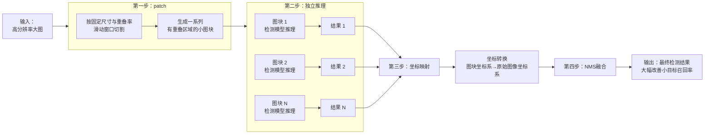
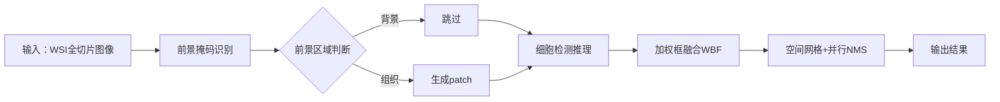

# 高分辨率图像patch训练与推理

> 文档目的：
> 本文档用于算法/工程背景下理解SAHI方法在高分辨率图像检测中的应用，重点回答以下问题：
>
> * 高分辨率图像检测面临哪些核心问题？
> * SAHI如何通过"分而治之，再合并"策略解决这些问题？
> * 在WSI病理图像等特定场景下需要哪些优化策略？
>
> 本文档旨在为高分辨率图像检测任务提供技术方案参考和工程实现指导。

---

## 目录

- [1. 问题背景](#1-问题背景)
- [2. SAHI解决方案](#2-sahi解决方案)
- [3. WSI病理图像场景优化](#3-wsi病理图像场景优化)
  - [3.1 前景目标粗分割](#31-前景目标粗分割)
  - [3.2 空间网格与并行优化](#32-空间网格与并行优化)
  - [3.3 工程架构优化](#33-工程架构优化)
- [4. 训练与推理优化策略](#4-训练与推理优化策略)
- [5. 常见问题与注意事项](#5-常见问题与注意事项)
- [6. 参考文献](#6-参考文献)

---

## 1. 问题背景

标准检测模型(YOLO[[1]](#ref1)、Faster R-CNN[[2]](#ref2)等)通常在固定尺寸(如640×640)下训练。但在处理高分辨率图像(4000×3000像素以上)时，直接应用这些模型会遇到明显问题：内存不足、显存溢出，因为模型无法直接处理如此大的输入尺寸。

为了解决这个问题，人们通常采用两种方法。第一种是暴力缩放：直接将整张高分辨率图像缩放到模型输入尺寸。这种做法虽然解决了内存问题，但会导致严重的信息丢失，因为图像经过特征提取网络时会进行多次下采样，小目标的特征在这个过程中可能完全丢失。例如，当输入一张4000×3000像素的大图时，模型会将其暴力缩放到640×640，图像中的小目标(可能只有几十个像素)被压缩到几乎不可见，从而无法被检测到。

第二种是基于patch处理：将高分辨率图像切分成多个patch，采用patch进行模型训练并检测。这种做法虽然避免了缩放带来的信息损失，但会带来两个新问题。一是上下文信息丢失，每个patch只能看到局部区域，缺乏全局上下文信息，一些需要全局信息才能准确检测的目标(如大目标、需要空间关系的目标)可能被误检或漏检；二是边界处理困难，patch边界处的目标可能被截断，导致检测不完整。针对这个问题，有两种处理方式：如果采用无重叠的patch切分，边界目标会被破坏；如果采用有重叠的patch切分，虽然可以保证边界目标的完整性，但会产生重复检测的问题。

因此，我们需要一种新方法：既能让模型在固定尺寸下工作以保持检测能力，又能处理高分辨率图像，同时避免暴力缩放导致的小目标丢失，以及基于patch方法导致的上下文丢失和边界处理困难，在精度和效率之间取得平衡。

---

## 2. SAHI解决方案

针对高分辨率图像检测中模型无法直接处理大尺寸输入、暴力缩放导致小目标丢失、以及基于patch方法导致上下文丢失和边界处理困难的问题，SAHI采用"分而治之，再合并"的核心思路，通过改变模型的观察方式(从整体缩放变为局部细看)来缓解这些问题[[3]](#ref3)。整个方案包含四个关键步骤。

第一步是重叠patch：针对模型无法直接处理高分辨率图像的问题，使用滑动窗口将高分辨率图像切割成重叠的小块，窗口尺寸通常设为模型训练尺寸(如512×512)，重叠率设置为0.1~0.3(推荐0.2)。重叠机制至关重要，无重叠会导致边界目标被截断而漏检，重叠区域能保证每个边界目标至少完整出现在一个patch中。

第二步是独立推理：针对暴力缩放导致小目标丢失的问题，将每个patch独立送入预训练好的检测模型进行前向传播。这个过程高度可并行化，可以利用GPU批量处理。每个patch都在模型训练尺寸下推理，避免了缩放带来的信息损失，模型在"舒适区"工作，对小目标具有更好的检测能力。

第三步是坐标映射：将每个patch上的检测结果从局部坐标系转换到原始图像的全局坐标系。转换公式为：x_global = x_local + offset_x，y_global = y_local + offset_y。

第四步是NMS融合：针对基于patch方法导致的重复检测问题，由于patch之间有重叠，同一个真实目标可能在多个相邻patch中被重复检测。需要对全局坐标系下的所有检测框应用NMS算法：按类别分组，计算IoU，保留置信度最高的框，抑制重复框[[4]](#ref4)。

下图是从patch到结果融合的完整工作流程：

SAHI方案有效解决了高分辨率图像检测中的核心问题：通过重叠patch避免了边界目标截断，通过独立推理避免了暴力缩放导致的小目标丢失，通过坐标映射和NMS融合解决了重复检测问题。在大多数高分辨率图像检测场景中，这种"分而治之，再合并"的策略能够显著提升小目标检测的召回率，核心权衡是用计算时间换取检测精度。

然而，在特定应用场景下，标准的SAHI流程会遇到新的挑战。例如，在病理图像细胞检测与分割任务中，当处理超高分辨率全切片图像(WSI)时，patch数量可能达到十几万甚至更多，且重叠区域目标极度密集，此时标准的全局NMS融合在计算上不可行，需要进一步优化[[5]](#ref5)。

---

## 3. WSI病理图像场景优化

针对WSI病理图像细胞检测场景，需要尽可能降低推理时间。主要优化方向包括：通过前景目标粗分割，让模型只对有组织区域的patch进行推理，从而通过减少patch数量，降低推理时间；采用空间网格+并行优化提升NMS/WBF[[6]](#ref6)框过滤效率；采用流式处理实现边推理边映射拼接，而非全部推理结束后再进行结果处理，提升整个推理流程的效率。

下图展示了完整的处理流程：

### 3.1 前景目标粗分割

目标是"只处理必须处理的区域"，从根本上减少无效patch的生成，从而降低推理时间消耗。基于前景掩码的采样的核心思想是只在前景区域生成patch，而非均等地切分全图。

具体实现时，首先在低分辨率尺度上进行前景目标的粗分割，获取目标前景掩码。可以采用传统方法(阈值分割和形态学处理)，也可以训练一个轻量化的轮廓分割模型。然后生成采样网格，在将包含前景区域的网格中心根据缩放比例映射到高分辨率的对应位置，只在这些位置生成待检测的目标patch图像。对于没有前景的网格区域，直接跳过，不生成patch。这样可以大幅减少无效patch的数量，显著降低推理时间消耗。

采样网格的生成方法：首先设定patch大小和重叠率。由于patch之间存在重叠区域，需要生成不重叠的采样网格来决定在哪些位置生成patch。网格划分的关键约束包括：第一，网格边界必须大于patch大小；第二，网格边界必须避开patch的重叠区域，即网格边界不能落在重叠区域内。无论x方向还是y方向，第一个patch都是特殊的patch，由于没有前一个patch，需要特殊处理；对于后续patch，网格边界应设置在非重叠区域内(即当前patch减去与前一个patch重叠部分后的区域)。对于网格边界上的中心点，采用左闭右开或上闭下开的归属策略，确保每个中心点只归属于一个网格。边界情况处理：当图像边界不足一个网格或patch大小时，对patch进行填充0处理，但网格不需要填充。需要计算网格是否覆盖整个目标图像，确保网格能够完整覆盖目标图像的所有区域。网格尺寸需要合理设置：过小会导致patch数量过多，过大则会导致单个网格内目标过多，可能引发显存溢出。

### 3.2 空间网格与并行优化

当检测框数量达到数万甚至数十万时，必须抛弃传统的全局NMS，采用可并行、可增量的算法。

空间网格+并行NMS：将图像划分为不重叠的网格，根据检测框中心点坐标将其分配到对应网格中，对每个网格内的检测框独立进行NMS。由于同一个目标产生的冗余框会被分配到同一个或相邻的几个网格内，对每个网格独立进行NMS就能处理大部分重复检测。每个网格内的框数量约为总框数的1/k(k为网格总数)，单网格NMS计算极快，且所有网格的处理可以完美并行。这种方法将O(n²)的全局计算复杂度降为O((n/k)²)，大幅提升了处理效率。对于8000×6000像素、10万个检测框的场景，划分为20×20网格后，计算量从100亿次降低到约6万次，结合CUDA并行处理，总处理时间从数小时降低到数分钟。

加权框融合(WBF)：NMS的替代方案，特别适合高密度小目标场景。在目标极度密集、框间重叠很高时，NMS容易误删正确目标。WBF采用加权平均的思路，将高度重叠的框视为对同一目标的多次观测，将它们的位置和置信度进行加权平均，融合成一个更精确的框。这种方法能保留更多被NMS误杀的目标，但计算量比NMS略高。

### 3.3 工程架构优化

当数据量达到数十万patch级别，单机可能已达极限，需要系统级优化。

流式处理：不等待所有patch推理完成后再融合，而是边patch、边推理、边融合。一旦一个patch的检测结果出来，立即映射到全局坐标系，并增量更新到全局的空间索引结构(如R-Tree或网格索引)中，即时进行局部融合。这种方法大幅降低内存峰值占用，适合处理流式输入或内存受限的环境。

性能分析与优化：通过性能分析工具(如NVIDIA Nsight、PyTorch Profiler等)识别性能瓶颈，针对性地优化热点代码。重点关注patch生成、模型推理、坐标映射和融合等关键环节的耗时，通过批量处理、异步I/O、内存池等技术提升整体性能。

内存管理：对于超大规模场景，需要精细的内存管理策略。采用内存池技术复用内存空间，及时释放不再使用的中间结果，使用内存映射文件处理超大图像，避免内存峰值过高导致系统崩溃。对于分布式场景，还需要考虑跨节点的内存数据传输优化。

---

## 4. 训练与推理优化策略

训练数据采样策略：在训练阶段，应该优先采样包含细胞的patch，避免过多采样背景区域。可以采用基于目标密度的采样策略：统计每个patch中的细胞数量，在细胞密集区域增加采样频率，在稀疏区域减少采样。具体实现时，可以设置一个密度阈值，只采样细胞数量超过阈值的patch，或者根据细胞密度设置不同的采样权重。

推理阶段优化：推理阶段的基于前景掩码的智能采样已在源头控制部分说明，这里不再重复。

---

## 5. 常见问题与注意事项

重叠率设置不当：过小会导致边界目标漏检，过大则会导致计算量爆炸，建议先在小区域测试后逐步调整。

坐标映射错误：会导致检测框位置偏移，需要仔细验证坐标转换公式，使用单元测试确保正确性。

参数验证：在验证结果时，建议先在小区域测试参数配置，然后可视化检查检测结果，计算mAP、召回率、精确率等指标，特别关注patch边界区域的检测结果。

---

## 6. 参考文献

**[1]** Redmon J, Divvala S, Girshick R, et al. You Only Look Once: Unified, Real-Time Object Detection. In: Proceedings of the IEEE Conference on Computer Vision and Pattern Recognition (CVPR). 2016: 779-788. YOLO系列检测模型的原始论文，这些模型通常在固定尺寸下训练，是SAHI方法应用的主要目标检测模型之一。

**[2]** Ren S, He K, Girshick R, et al. Faster R-CNN: Towards Real-Time Object Detection with Region Proposal Networks. IEEE Transactions on Pattern Analysis and Machine Intelligence. 2017;39(6):1137-1149. Faster R-CNN是两阶段目标检测模型的代表，通常在固定尺寸下训练，也是SAHI方法应用的主要目标检测模型之一。

**[3]** Akyon FC, Altinuc SO, Temizel A. Slicing Aided Hyper Inference and Fine-tuning for Small Object Detection. In: 2022 IEEE International Conference on Image Processing (ICIP). 2022: 966-970. SAHI方法的原始论文，提出了"分而治之，再合并"的核心思路，通过重叠patch、独立推理、坐标映射和NMS融合四个步骤解决高分辨率图像中小目标检测的问题。该方法在不修改模型结构的前提下，显著提升了小目标检测的召回率。

**[4]** Neubeck A, Van Gool L. Efficient non-maximum suppression. In: 18th International Conference on Pattern Recognition (ICPR'06). 2006: 850-855. 提出了高效的NMS算法，用于处理目标检测中的重复框问题。NMS通过计算IoU、保留置信度最高的框、抑制重复框，是SAHI方案中融合步骤的核心算法。

**[5]** 高分辨率医学图像处理中的patch-based方法优化策略。在处理WSI等超高分辨率医学图像时，标准的SAHI流程会遇到计算瓶颈。相关研究显示，patch-based方法结合前景分割、空间网格优化和流式处理等策略，能够有效提升处理效率和检测精度，适用于大规模病理图像分析场景。

**[6]** Solovyev R, Wang W, Gabruseva T. Weighted boxes fusion: ensembling boxes from different object detection models. Image and Vision Computing. 2021;107:104117. 提出了加权框融合(WBF)方法，作为NMS的替代方案。WBF采用加权平均的思路，将高度重叠的框视为对同一目标的多次观测，融合成更精确的框，特别适合高密度小目标场景，能保留更多被NMS误杀的目标。
